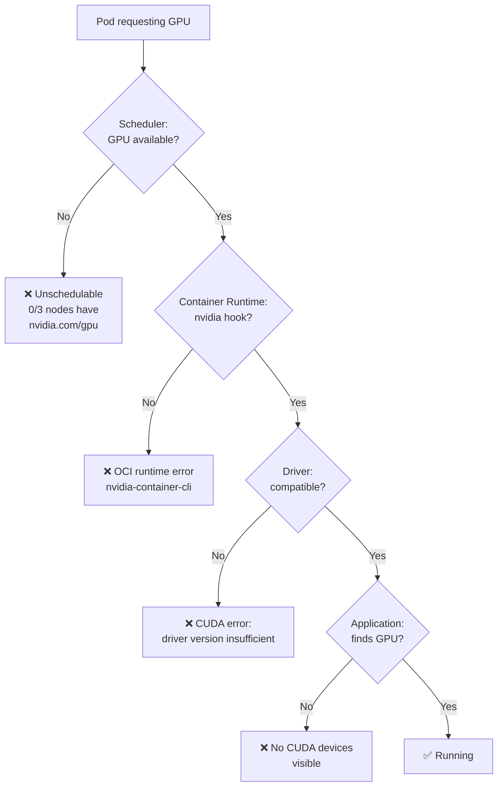

> 💡 **Quick Answer:** GPU pod failures on Kubernetes typically fall into 5 categories: device plugin not running (no GPUs advertised), driver version mismatch (CUDA error), insufficient GPU resources (Unschedulable), DRA claim pending (no matching device), or container runtime misconfiguration (nvidia runtime not default). Start with `kubectl describe pod` → check Events → verify `kubectl get nodes -o json | jq '.items[].status.capacity'` shows GPUs.

## The Problem

Kubernetes v1.36 highlights device-related pod failures as a growing operational concern as GPU workloads increase. GPU scheduling adds complexity beyond CPU/memory: device drivers, container runtime hooks, device plugins or DRA drivers, CUDA library compatibility, and multi-GPU topology. When something fails, error messages are often cryptic.



## The Solution

### Step 1: Check GPU Resources on Nodes

```bash
# Are GPUs visible to Kubernetes?
kubectl get nodes -o custom-columns=\
NAME:.metadata.name,\
GPU_CAPACITY:.status.capacity.nvidia\.com/gpu,\
GPU_ALLOCATABLE:.status.allocatable.nvidia\.com/gpu

# Expected:
# NAME          GPU_CAPACITY   GPU_ALLOCATABLE
# gpu-node-1    4              4
# gpu-node-2    4              3    (1 allocated)
# cpu-node-1    <none>         <none>

# If GPU_CAPACITY is <none>, device plugin is not running
```

### Step 2: Verify Device Plugin / GPU Operator

```bash
# Check NVIDIA device plugin pods
kubectl get pods -n gpu-operator -l app=nvidia-device-plugin-daemonset
kubectl get pods -n kube-system -l app=nvidia-device-plugin

# Check logs for errors
kubectl logs -n gpu-operator -l app=nvidia-device-plugin-daemonset --tail=50

# Common errors:
# "failed to initialize NVML" → driver not loaded
# "no devices found" → driver loaded but no GPUs detected
# "failed to start device plugin server" → socket permission issue

# Check GPU Operator status
kubectl get clusterpolicy -o yaml | grep -A5 "status:"
```

### Step 3: Diagnose Pod Scheduling Failures

```bash
# Pod stuck in Pending
kubectl describe pod my-gpu-pod

# Look for Events like:
# "0/5 nodes are available: 5 Insufficient nvidia.com/gpu"
# → Not enough GPUs available
# "0/5 nodes are available: 5 didn't match Pod's node affinity"
# → Node selector/affinity too restrictive

# Check current GPU allocation
kubectl get pods -A -o json | jq '
  [.items[] | select(.spec.containers[].resources.limits["nvidia.com/gpu"] != null) |
  {name: .metadata.name, namespace: .metadata.namespace, 
   node: .spec.nodeName, gpus: .spec.containers[].resources.limits["nvidia.com/gpu"]}]'
```

### Step 4: Fix Container Runtime Errors

```bash
# Error: "OCI runtime create failed: nvidia-container-cli: initialization error"
# → NVIDIA container runtime not configured

# Check containerd config
cat /etc/containerd/config.toml | grep -A5 nvidia

# Expected:
# [plugins."io.containerd.grpc.v1.cri".containerd.runtimes.nvidia]
#   runtime_type = "io.containerd.runc.v2"
# [plugins."io.containerd.grpc.v1.cri".containerd.runtimes.nvidia.options]
#   BinaryName = "/usr/bin/nvidia-container-runtime"

# Fix: install nvidia-container-toolkit
sudo nvidia-ctk runtime configure --runtime=containerd
sudo systemctl restart containerd

# Verify runtime works
sudo ctr run --rm --gpus 0 docker.io/nvidia/cuda:12.5.0-base-ubuntu22.04 test nvidia-smi
```

### Step 5: Fix CUDA / Driver Mismatches

```bash
# Error: "CUDA driver version is insufficient for CUDA runtime version"
# → Container needs newer driver than what's installed on the node

# Check driver version on node
nvidia-smi --query-gpu=driver_version --format=csv,noheader

# Check what CUDA version the container needs
# CUDA 12.5 needs driver ≥ 555.42
# CUDA 12.4 needs driver ≥ 550.54
# CUDA 12.2 needs driver ≥ 535.86
# CUDA 12.0 needs driver ≥ 525.60
# CUDA 11.8 needs driver ≥ 520.61

# Fix: either upgrade node driver or use older CUDA base image
```

### Step 6: DRA-Specific Troubleshooting

```bash
# For DRA (v1.34+): ResourceClaim not being allocated
kubectl get resourceclaims -n ai-inference
kubectl describe resourceclaim training-gpu -n ai-inference

# Common DRA issues:
# "no devices match the claim's selectors"
# → CEL expression too restrictive or wrong device attribute name

# Check what devices are available
kubectl get resourceslices -o yaml

# Check device attributes
kubectl get resourceslices -o json | jq '.items[].devices[].basic.attributes'
```

### Common Error Messages and Fixes

| Error | Cause | Fix |
|-------|-------|-----|
| `Insufficient nvidia.com/gpu` | All GPUs allocated or no GPU nodes | Scale GPU nodes or wait for pods to finish |
| `nvidia-container-cli: initialization error` | NVIDIA runtime not configured | Install nvidia-container-toolkit, restart containerd |
| `CUDA driver version insufficient` | Node driver too old for container CUDA | Upgrade driver or pin older CUDA image |
| `failed to initialize NVML: driver not loaded` | NVIDIA kernel module not loaded | `sudo modprobe nvidia` or reboot node |
| `GPU UUID not found` | Device plugin stale after driver update | Restart nvidia-device-plugin pod |
| `no devices found on plugin registration` | GPU hardware fault or driver crash | Check `dmesg` for Xid errors, reset GPU |
| `MIG configuration invalid` | Wrong MIG profile for workload | Reconfigure MIG with `nvidia-smi mig` |
| `ResourceClaim pending` | DRA selector matches no device | Relax CEL expression or add matching hardware |
| `ErrImagePull` for NVCR images | Missing NGC API key | Create `imagePullSecret` with NGC credentials |

### GPU Health Diagnostic Script

```bash
#!/bin/bash
# gpu-diagnostics.sh — run on GPU node
echo "=== Driver ==="
nvidia-smi --query-gpu=driver_version,name,memory.total,memory.used \
  --format=csv

echo -e "\n=== Processes ==="
nvidia-smi pmon -c 1

echo -e "\n=== Xid Errors (hardware faults) ==="
dmesg | grep -i "NVRM: Xid" | tail -10

echo -e "\n=== Container Runtime ==="
nvidia-container-cli info

echo -e "\n=== Device Plugin ==="
ls -la /var/lib/kubelet/device-plugins/nvidia*.sock 2>/dev/null || echo "No device plugin socket found"

echo -e "\n=== MIG Status ==="
nvidia-smi mig -lgi 2>/dev/null || echo "MIG not enabled"
```

### Monitoring GPU Health

```yaml
# DCGM Exporter for Prometheus GPU metrics
apiVersion: apps/v1
kind: DaemonSet
metadata:
  name: dcgm-exporter
  namespace: gpu-operator
spec:
  selector:
    matchLabels:
      app: dcgm-exporter
  template:
    spec:
      containers:
        - name: dcgm-exporter
          image: nvcr.io/nvidia/k8s/dcgm-exporter:3.3.8-3.6.0-ubuntu22.04
          ports:
            - containerPort: 9400
          env:
            - name: DCGM_EXPORTER_COLLECTORS
              value: "/etc/dcgm-exporter/dcp-metrics-included.csv"
          securityContext:
            privileged: true
```

```bash
# Key metrics to alert on:
# DCGM_FI_DEV_GPU_TEMP > 90°C → thermal throttling
# DCGM_FI_DEV_XID_ERRORS > 0 → hardware fault
# DCGM_FI_DEV_MEM_COPY_UTIL > 95% → memory pressure
# DCGM_FI_DEV_GPU_UTIL == 0 for 30m → GPU idle (waste)
```

## Best Practices

- **Always check `kubectl describe pod` first** — Events section tells you exactly what failed
- **Verify GPU capacity on nodes** — if nodes show 0 GPUs, fix device plugin before anything else
- **Pin CUDA versions** — match container CUDA to node driver compatibility matrix
- **Monitor Xid errors** — hardware faults (Xid 48, 63, 79) need physical GPU replacement
- **Restart device plugin after driver updates** — stale GPU UUIDs cause phantom devices
- **Use DCGM Exporter** — Prometheus metrics for temperature, utilization, errors

## Key Takeaways

- GPU pod failures have 5 main root causes: device plugin, runtime, driver, scheduling, DRA
- Start diagnosis with `kubectl describe pod` → Events → node GPU capacity
- CUDA driver compatibility matrix is the #1 cause of container GPU failures
- DRA (v1.34+) adds new failure modes: ResourceClaim selectors must match device attributes
- Monitor GPU health with DCGM Exporter — Xid errors indicate hardware faults
- Always pin CUDA versions and driver versions for reproducible GPU deployments
