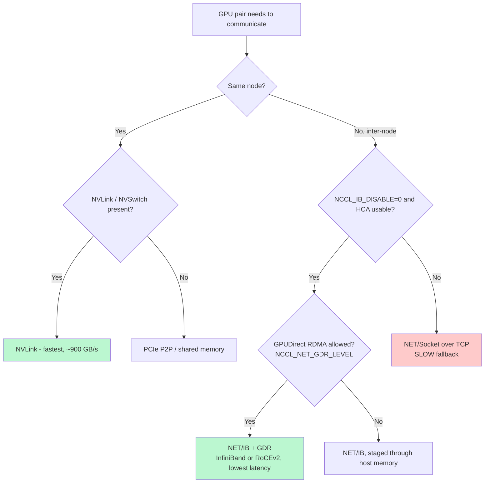

> 💡 **Quick Answer:** Turn on `NCCL_DEBUG=INFO` so you can see the chosen transport, set `NCCL_SOCKET_IFNAME` to your real data-plane interface (not `docker0`/`lo`), and pick a fabric explicitly: **InfiniBand/RoCE** with `NCCL_IB_DISABLE=0` + `NCCL_IB_HCA=mlx5_0,mlx5_1` + `NCCL_NET_GDR_LEVEL=SYS`, or **Ethernet TCP fallback** with `NCCL_IB_DISABLE=1`. Then confirm the logs say `NET/IB` (good) instead of `NET/Socket` (slow), and benchmark with `all_reduce_perf` to read `busbw`.

## The Problem

NCCL (NVIDIA Collective Communications Library) powers every multi-GPU and multi-node training job — PyTorch DDP/FSDP, DeepSpeed, Megatron, and inference servers all call into it for `all-reduce`, `all-gather`, and `reduce-scatter`. When NCCL silently falls back from RDMA to TCP sockets, throughput can collapse by **5–20×** and large training runs grind to a halt or burn budget at a fraction of the GPUs' capability.

In Kubernetes the failure mode is sneaky: pods have multiple interfaces (`eth0`, the CNI overlay, RDMA devices exposed by an operator), and NCCL auto-detection picks the wrong one. The fix is to **make transport selection explicit and reproducible** with a small, well-understood set of environment variables — then prove it with logs and a benchmark.

## How NCCL Chooses a Transport

NCCL builds a ring/tree topology and selects the fastest available path for each pair of GPUs. Understanding this order is the key to tuning it.



The goal of tuning is simple: **stay on the green paths and never silently land on the red one.**

## Complete NCCL Environment Variable Reference

| Variable | Purpose | Typical value |
|----------|---------|---------------|
| `NCCL_DEBUG` | Log verbosity (`VERSION`, `WARN`, `INFO`, `TRACE`) | `INFO` while tuning |
| `NCCL_DEBUG_SUBSYS` | Restrict logs to subsystems | `INIT,NET,GRAPH` |
| `NCCL_SOCKET_IFNAME` | Bootstrap/out-of-band interface | `eth0` or `=ib0` |
| `NCCL_IB_DISABLE` | `0` = use IB/RoCE verbs, `1` = force TCP | `0` on RDMA fabrics |
| `NCCL_IB_HCA` | Which RDMA HCAs/ports to use | `mlx5_0,mlx5_1` or `mlx5_0:1` |
| `NCCL_NET_GDR_LEVEL` | GPUDirect RDMA aggressiveness (`LOC`<`PIX`<`PXB`<`PHB`<`SYS`) | `SYS` (or `PHB`) |
| `NCCL_IB_GID_INDEX` | RoCE GID table index (RoCEv2) | `3` (verify per host) |
| `NCCL_IB_TC` | RoCE traffic class / DSCP for QoS | `106` |
| `NCCL_IB_SL` | InfiniBand service level | `0`–`3` per fabric |
| `NCCL_IB_TIMEOUT` | QP timeout exponent; raise on large fabrics | `18`–`22` |
| `NCCL_IB_RETRY_CNT` | RDMA retry count | `7` |
| `NCCL_IB_QPS_PER_CONNECTION` | Multiple QPs to spread load | `2`–`4` |
| `NCCL_IB_ADAPTIVE_ROUTING` | Use switch adaptive routing | `1` if supported |
| `NCCL_CROSS_NIC` | Allow rings to cross NICs | `1` on rail-optimized fabrics |
| `NCCL_BUFFSIZE` | Per-channel buffer (bytes) | `8388608` (8 MB) |
| `NCCL_NSOCKS_PERTHREAD` / `NCCL_SOCKET_NTHREADS` | TCP parallelism (Ethernet only) | `4` / `2` |
| `NCCL_P2P_LEVEL` / `NCCL_P2P_DISABLE` | Intra-node NVLink/PCIe control | leave default |
| `NCCL_ALGO` / `NCCL_PROTO` | Force algorithm/protocol (advanced) | unset unless tuning |

> ⚠️ Resist the urge to set everything. Start from the minimal profiles below, confirm the transport in the logs, then change **one variable at a time**.

## Profile 1 — InfiniBand / RoCE (RDMA)

This is the high-performance path for clusters with Mellanox/NVIDIA ConnectX HCAs exposed via the [RDMA shared device plugin](https://github.com/Mellanox/k8s-rdma-shared-dev-plugin) or the Network Operator.

```yaml
apiVersion: v1
kind: Pod
metadata:
  name: nccl-rdma-training
spec:
  containers:
  - name: training
    image: nvcr.io/nvidia/pytorch:25.11-py3
    env:
    # Use the RDMA verbs transport (never fall back to TCP silently)
    - name: NCCL_IB_DISABLE
      value: "0"
    # Select the HCA(s) — match `ibstat` / `ibv_devices` on the node
    - name: NCCL_IB_HCA
      value: "mlx5_0,mlx5_1"
    # Bootstrap interface for rendezvous (out-of-band), NOT the data path
    - name: NCCL_SOCKET_IFNAME
      value: "eth0"
    # Enable GPUDirect RDMA so NICs DMA straight to GPU memory
    - name: NCCL_NET_GDR_LEVEL
      value: "SYS"
    # Larger buffers help large-message all-reduce
    - name: NCCL_BUFFSIZE
      value: "8388608"
    # Adaptive routing on supported switches reduces hot-spot congestion
    - name: NCCL_IB_ADAPTIVE_ROUTING
      value: "1"
    - name: NCCL_DEBUG
      value: "INFO"
    resources:
      limits:
        nvidia.com/gpu: 8
        rdma/rdma_shared_device_a: 1
```

## Profile 2 — RoCEv2 over Ethernet

RoCEv2 gives you RDMA performance over a (lossless, PFC/ECN-configured) Ethernet fabric. It still uses the IB verbs path, so `NCCL_IB_DISABLE` stays `0` — but you must pin the **GID index** and **traffic class**.

```yaml
env:
# RoCE still goes through the IB/verbs transport
- name: NCCL_IB_DISABLE
  value: "0"
- name: NCCL_IB_HCA
  value: "mlx5_0,mlx5_1"
# RoCEv2 GID index — confirm with `show_gids` (often 3, but verify!)
- name: NCCL_IB_GID_INDEX
  value: "3"
# Traffic class / DSCP so switches honor your lossless (PFC) queue
- name: NCCL_IB_TC
  value: "106"
# Bootstrap + (if needed) socket selection on the RoCE NIC
- name: NCCL_SOCKET_IFNAME
  value: "eth0"
- name: NCCL_NET_GDR_LEVEL
  value: "SYS"
```

Find the correct GID index inside the pod:

```bash
# List RoCE GIDs; pick the RoCEv2 (IPv4) entry's index
show_gids
# DEV     PORT  INDEX  GID                                      IPv4         VER
# mlx5_0  1     3      0000:0000:...:ffff:0a00:0065             10.0.0.101   v2
```

## Profile 3 — Ethernet TCP (No RDMA)

When there is no RDMA fabric (e.g., commodity cloud nodes), force the socket transport and tune TCP parallelism. Expect far lower bandwidth — use this only as a deliberate fallback.

```yaml
env:
# No RDMA available — use TCP sockets
- name: NCCL_IB_DISABLE
  value: "1"
# Pin the high-bandwidth data NIC (avoid lo / docker0 / CNI overlay)
- name: NCCL_SOCKET_IFNAME
  value: "eth0"
# Parallelize TCP to recover some bandwidth
- name: NCCL_NSOCKS_PERTHREAD
  value: "4"
- name: NCCL_SOCKET_NTHREADS
  value: "2"
- name: NCCL_DEBUG
  value: "INFO"
```

## Validate the Transport From the Logs

Always confirm what NCCL actually selected — auto-detection lies often enough to make this mandatory.

```bash
export NCCL_DEBUG=INFO
export NCCL_DEBUG_SUBSYS=INIT,NET,GRAPH
```

```text
# ✅ GOOD — RDMA in use (InfiniBand or RoCEv2), GPUDirect enabled
[0] NCCL INFO NET/IB : Using [0]mlx5_0:1/RoCE [1]mlx5_1:1/RoCE ; GDR enabled
[0] NCCL INFO Channel 00 : 0[1c000] -> 1[1d000] via P2P/IPC
[0] NCCL INFO Connected all rings

# ❌ BAD — silently fell back to TCP sockets
[0] NCCL INFO NET/Socket : Using [0]eth0:10.0.0.5<0>
```

If you see `NET/Socket` when you expected RDMA, the HCA name, GID index, or RDMA resource limit is wrong — jump to [Troubleshooting](#troubleshooting-matrix).

## Benchmark and Read `busbw`

Numbers beat guesses. Run the [NCCL tests](https://github.com/NVIDIA/nccl-tests) `all_reduce_perf` and read **bus bandwidth** (`busbw`), which normalizes for collective size and is the number to compare across runs.

```bash
# 8 GPUs, sweep message sizes 8 bytes -> 8 GiB, doubling each step
all_reduce_perf -b 8 -e 8G -f 2 -g 8
```

```text
#       size      time   algbw   busbw  #wrong
#        (B)      (us)  (GB/s)  (GB/s)
     8388608     230.1   36.45  68.34      0
    33554432     742.9   45.16  84.67      0
   134217728    2680.3   50.07  93.88      0
   536870912   10210.4   52.58  98.59      0
# Out of bounds values : 0 OK
# Avg bus bandwidth    : 86.37 GB/s
```

How to read it:

- **`busbw` plateaus near the fabric's line rate** at large sizes → healthy (e.g., ~90+ GB/s on a 100 Gb RoCE link).
- **`busbw` caps at a few GB/s** → you are on TCP, GDR is off, or PFC/ECN is misconfigured.
- **`#wrong > 0`** → data corruption; stop and fix the fabric before training.

## Performance Reference

| Transport | Bandwidth | Latency | Use case |
|-----------|-----------|---------|----------|
| NVLink / NVSwitch | ~900 GB/s | <1 μs | Intra-node GPU↔GPU |
| InfiniBand HDR | 200 Gb/s | 1–2 μs | Inter-node RDMA |
| InfiniBand NDR | 400 Gb/s | ~1 μs | Inter-node RDMA (latest) |
| RoCE v2 | 100–400 Gb/s | 2–5 μs | Inter-node Ethernet RDMA |
| TCP sockets | 25–100 Gb/s | 10–50 μs | Fallback only |

## Troubleshooting Matrix

| Symptom | Likely cause | Fix |
|---------|--------------|-----|
| Logs show `NET/Socket` instead of `NET/IB` | Wrong/empty `NCCL_IB_HCA`, missing RDMA resource | Set `NCCL_IB_HCA` to a device from `ibstat`; request `rdma/...` in `resources.limits` |
| RDMA selected but bandwidth still low | GPUDirect not active | Set `NCCL_NET_GDR_LEVEL=SYS`; confirm `GDR enabled` in logs; check `nvidia-peermem`/`gdrcopy` |
| RoCE connects but stalls / retransmits | GID index or DSCP wrong, no PFC/ECN | Verify with `show_gids`; set `NCCL_IB_GID_INDEX` + `NCCL_IB_TC`; enable lossless on switches |
| Hangs at startup, no progress | Bootstrap on wrong interface | Set `NCCL_SOCKET_IFNAME` to a routable data NIC, exclude `lo`/`docker0` |
| Works on 1 node, fails multi-node | East-west traffic blocked or MTU mismatch | Check NetworkPolicy, firewall, and consistent jumbo-frame MTU |
| Intermittent timeouts on large fabric | Default IB timeout too low | Raise `NCCL_IB_TIMEOUT=20` and `NCCL_IB_RETRY_CNT=7` |

> 🔧 For deeper hang analysis see [Debug NCCL Timeouts and Hangs in Kubernetes](/recipes/troubleshooting/debug-nccl-timeouts-kubernetes/).

## Tuning Cheat Sheet by Fabric

```bash
# InfiniBand (HDR/NDR)
NCCL_IB_DISABLE=0  NCCL_IB_HCA=mlx5_0,mlx5_1  NCCL_NET_GDR_LEVEL=SYS

# RoCEv2 (lossless Ethernet)
NCCL_IB_DISABLE=0  NCCL_IB_HCA=mlx5_0  NCCL_IB_GID_INDEX=3  NCCL_IB_TC=106  NCCL_NET_GDR_LEVEL=SYS

# Ethernet TCP (no RDMA)
NCCL_IB_DISABLE=1  NCCL_SOCKET_IFNAME=eth0  NCCL_NSOCKS_PERTHREAD=4  NCCL_SOCKET_NTHREADS=2
```

## Best Practices

- **Make it explicit, not magic.** Pin the transport, HCA, and interface so runs are reproducible across nodes and reboots.
- **Change one variable at a time** and re-benchmark; NCCL tuning is empirical.
- **Commit per-cluster baseline profiles** (as a ConfigMap or Helm values) to version control.
- **Re-validate after upgrades** to CNI, NIC firmware, GPU driver, or the NCCL/CUDA base image — transport selection can silently change.
- **Bake validation into CI** with a small `all_reduce_perf` smoke test so regressions surface before a 1,000-GPU run.
- **Never benchmark with `NCCL_DEBUG=INFO` left on** in production — it adds overhead; use it to validate, then drop to `WARN`.

## Frequently Asked Questions

**Should `NCCL_IB_DISABLE` be `0` or `1` for RoCE?**
`0`. RoCEv2 uses the InfiniBand verbs transport over Ethernet, so the IB path must stay enabled. You only set `1` when there is genuinely no RDMA hardware.

**What does `NCCL_SOCKET_IFNAME` control if I'm using RDMA?**
It selects the out-of-band bootstrap/rendezvous interface, not the bulk data path. Point it at a routable NIC; the heavy traffic still flows over the RDMA HCA.

**How do I know GPUDirect RDMA is actually working?**
Look for `GDR enabled` in the `NCCL_DEBUG=INFO` output and confirm the `nvidia-peermem` kernel module is loaded on the node. Without it, traffic stages through host memory and latency rises.

**Why is my `busbw` half the link rate?**
Common causes: GDR disabled, TCP fallback, missing PFC/ECN on a RoCE fabric, or a single QP per connection. Enable `NCCL_NET_GDR_LEVEL=SYS`, verify the transport, and try `NCCL_IB_QPS_PER_CONNECTION=2`.

**Where do I get `all_reduce_perf`?**
Build the [nccl-tests](https://github.com/NVIDIA/nccl-tests) repo, or use an image that ships it. Pair it with [Run NCCL Tests on Kubernetes](/recipes/ai/run-nccl-tests-kubernetes/) to run it as a Job.
