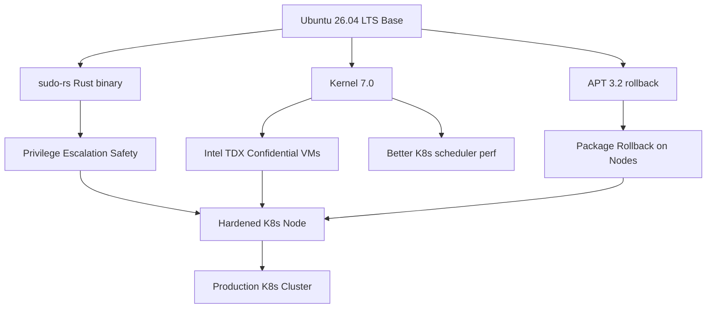

> 💡 **Quick Answer:** Ubuntu 26.04 LTS (Resolute Raccoon) ships **sudo-rs** as the default sudo provider — a full Rust rewrite of the 44-year-old C binary that handles privilege escalation on every Linux node. For Kubernetes clusters, this eliminates an entire class of memory-safety CVEs on the host OS. Combine with APT 3.2 rollback, Kernel 7.0 TDX, and native ROCm for hardened, GPU-ready K8s nodes.

## The Problem

Every Kubernetes node runs `sudo` — the binary that grants root access. The original C implementation has been around since 1980 and has accumulated serious CVEs:

- **CVE-2021-3156 (Baron Samedit)**: Heap buffer overflow allowing local privilege escalation. **10 years of unpatched exposure** across most Linux distros
- **CVE-2023-22809**: sudoedit arbitrary file write
- **CVE-2023-28486/28487**: sudo log injection

On a Kubernetes node, a container escape combined with a sudo vulnerability gives an attacker full node control. Most Ubuntu 26.04 coverage won't mention this change, but it's the single most important security improvement for infrastructure operators.

## The Solution

### sudo-rs: Drop-In Rust Replacement

sudo-rs is a complete rewrite of sudo in Rust. Same `/etc/sudoers` config syntax. Same CLI interface. Drop-in replacement. The memory safety guarantees Rust provides matter specifically here — on the binary that handles privilege escalation.

This isn't experimental:
- Passed a **full security audit in 2023**
- The sudo-rs team worked directly with the **original sudo maintainer**
- Ubuntu 26.04 making it the default is the signal that it's **production-ready**

```bash
# Verify sudo-rs on Ubuntu 26.04
sudo --version
# sudo-rs 0.2.x

# Existing /etc/sudoers works unchanged
visudo -c
# /etc/sudoers: parsed OK

# On older Ubuntu nodes, install manually
sudo apt install sudo-rs
```

### Validate sudo-rs on K8s Node Images

For teams building hardened base images (Packer, cloud-init, or MachineConfig):

```yaml
# cloud-init user-data for K8s node bootstrap
#cloud-config
package_update: true
package_upgrade: true
packages:
  - sudo-rs
  - apt-transport-https
  - ca-certificates
  - curl
runcmd:
  # Verify sudo-rs is active
  - sudo --version | grep -q "sudo-rs" && echo "sudo-rs OK" || echo "FAIL: still on legacy sudo"
  # Lock down sudoers
  - echo 'Defaults use_pty' >> /etc/sudoers.d/hardening
  - echo 'Defaults logfile="/var/log/sudo.log"' >> /etc/sudoers.d/hardening
  - chmod 0440 /etc/sudoers.d/hardening
```

### APT 3.2 Transaction Rollback

Ubuntu 26.04 ships APT 3.2 with a **transaction log and full rollback**. For K8s node maintenance, this is critical — a bad package update no longer requires node replacement:

```bash
# View package transaction history
apt history list

# Rollback any package operation
apt history-rollback <transaction-id>

# Example: kubelet upgrade broke something
apt history list | grep kubelet
# ID: 47  Date: 2026-04-27  Action: upgrade kubelet 1.30.1 → 1.31.0
apt history-rollback 47
# kubelet reverted to 1.30.1
```

For K8s node ops, validate this flow in your runbooks:

```bash
# Pre-upgrade snapshot
TXID_BEFORE=$(apt history list --json | jq '.[0].id')

# Upgrade
apt upgrade -y kubelet kubectl

# Verify node health
kubectl get node $(hostname) -o jsonpath='{.status.conditions[-1].type}'

# Rollback if unhealthy
if [ "$(kubectl get node $(hostname) -o jsonpath='{.status.conditions[-1].status}')" != "True" ]; then
  apt history-rollback $TXID_BEFORE
  systemctl restart kubelet
fi
```

### Kernel 7.0 — Intel TDX Confidential Computing

Kernel 7.0 brings **Intel TDX (Trust Domain Extensions)** support on the host side. For K8s clusters running confidential workloads:

```yaml
# Verify TDX support on nodes
apiVersion: batch/v1
kind: Job
metadata:
  name: tdx-check
spec:
  template:
    spec:
      nodeSelector:
        kubernetes.io/os: linux
      containers:
      - name: check
        image: ubuntu:26.04
        command: ["bash", "-c"]
        args:
        - |
          # Check kernel version
          uname -r  # Should show 7.0.x

          # Check TDX availability
          if [ -d /sys/firmware/tdx ]; then
            echo "TDX: available"
            cat /sys/firmware/tdx/tdx_module/status
          else
            echo "TDX: not available (check BIOS/firmware)"
          fi
      restartPolicy: Never
```

### ROCm in Official Repos — AMD GPU Compute

AMD GPU users no longer need third-party repos. ROCm is now a one-liner:

```bash
# On Ubuntu 26.04 K8s GPU nodes
sudo apt install rocm

# Verify
rocminfo | grep "Agent"
# Agent: gfx1100 (RX 7900 XTX)

# Deploy AMD GPU device plugin on K8s
kubectl apply -f https://raw.githubusercontent.com/ROCm/k8s-device-plugin/master/k8s-ds-amdgpu-dp.yaml
```

### Complete Ubuntu 26.04 K8s Node Hardening

```yaml
# DaemonSet to validate Ubuntu 26.04 hardening on all nodes
apiVersion: apps/v1
kind: DaemonSet
metadata:
  name: node-hardening-validator
  namespace: kube-system
spec:
  selector:
    matchLabels:
      app: node-validator
  template:
    metadata:
      labels:
        app: node-validator
    spec:
      hostPID: true
      nodeSelector:
        kubernetes.io/os: linux
      containers:
      - name: validator
        image: ubuntu:26.04
        command: ["bash", "-c"]
        args:
        - |
          echo "=== Ubuntu 26.04 K8s Node Hardening Check ==="

          # 1. sudo-rs
          if nsenter -t 1 -m -- sudo --version 2>&1 | grep -q "sudo-rs"; then
            echo "✅ sudo-rs active"
          else
            echo "❌ Legacy C sudo — upgrade to sudo-rs"
          fi

          # 2. Kernel version
          KERN=$(nsenter -t 1 -m -- uname -r)
          echo "Kernel: $KERN"
          if [[ "$KERN" == 7.* ]]; then
            echo "✅ Kernel 7.x"
          else
            echo "⚠️  Kernel < 7.0"
          fi

          # 3. APT rollback support
          if nsenter -t 1 -m -- apt history list &>/dev/null; then
            echo "✅ APT rollback available"
          else
            echo "❌ APT rollback not available"
          fi

          # 4. Wayland (no Xorg attack surface on GUI nodes)
          if ! nsenter -t 1 -m -- dpkg -l xorg 2>/dev/null | grep -q "^ii"; then
            echo "✅ No Xorg installed (reduced attack surface)"
          else
            echo "⚠️  Xorg present"
          fi

          echo "=== Check complete ==="
          sleep infinity
        securityContext:
          privileged: true
      tolerations:
      - operator: Exists
```



## Ubuntu 26.04 LTS Key Changes Summary

| Feature | Impact for K8s | Priority |
|---------|---------------|----------|
| **sudo-rs** (Rust) | Eliminates memory-safety CVEs on privilege escalation binary | 🔴 Critical |
| **APT 3.2 rollback** | Undo bad package upgrades on nodes without reimaging | 🔴 Critical |
| **Kernel 7.0** | Intel TDX, better cgroup v2, improved scheduling | 🟡 High |
| **ROCm in repos** | AMD GPU compute one-liner install | 🟡 High (GPU clusters) |
| **Wayland-only** | Removes Xorg attack surface entirely | 🟢 Medium |
| **Ptyxis terminal** | GPU-accelerated, better for node debugging | 🟢 Low |
| **LTS until 2031** | 5 years standard, 10 years with Ubuntu Pro | 🟡 High |

## Common Issues

**sudo-rs compatibility with custom sudoers**

sudo-rs supports standard `/etc/sudoers` syntax. Edge cases: some advanced `Defaults` options from the C version may not be implemented yet. Test with `visudo -c` and verify your automation still works.

**APT rollback on kubeadm-managed nodes**

When using `apt history-rollback` for kubelet, always restart the kubelet service after rollback. kubeadm nodes may need `kubeadm upgrade apply` re-run if the rollback crosses a minor version boundary.

**ROCm + K8s device plugin**

The AMD device plugin needs `--amd-gpu-dp-enabled=true` on the kubelet. On managed K8s (EKS, GKE), this requires a custom AMI or node group config.

## Best Practices

- **Validate sudo-rs first** when building hardened base images — it's the highest-impact security change
- **Test APT rollback flow** in your node maintenance runbooks before production
- **Pin kernel version** in production — don't auto-upgrade to 7.0.x point releases without testing
- **Use Ubuntu Pro** for 10-year LTS if running long-lived infrastructure
- **Audit sudoers** during the migration — use this as an opportunity to clean up legacy sudo rules

## Key Takeaways

- sudo-rs is the most important Ubuntu 26.04 change for K8s operators — eliminates a 44-year-old C attack surface
- APT rollback transforms node maintenance — bad upgrades are now reversible
- Kernel 7.0 + TDX enables confidential computing at the node level
- ROCm in official repos makes AMD GPU K8s clusters first-class
- LTS until 2031 (2036 with Pro) — safe foundation for long-lived clusters
