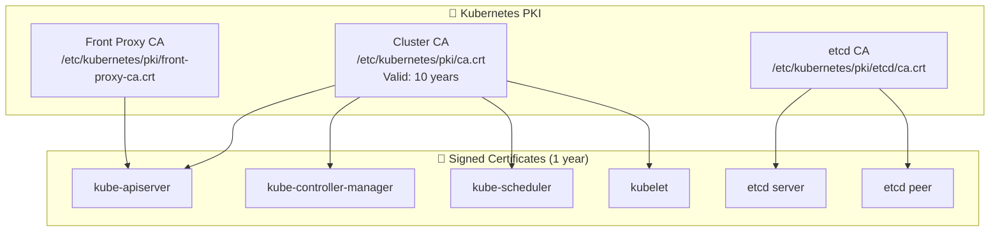

> 💡 **Quick Answer:** For kubeadm clusters, run `kubeadm certs renew all` on each control plane node, then restart kube-apiserver, kube-controller-manager, kube-scheduler, and etcd. For custom CA bundles (trusting internal CAs in pods), create a ConfigMap with your CA cert and mount it or use the `--trusted-ca-file` approach.
>
> ```bash
> # Check certificate expiration
> kubeadm certs check-expiration
>
> # Renew all certificates
> sudo kubeadm certs renew all
>
> # Restart control plane components
> sudo crictl pods --name 'kube-apiserver|kube-controller|kube-scheduler|etcd' -q | xargs -I{} sudo crictl stopp {}
> ```
>
> **Key concept:** Kubernetes uses multiple CA certificates — the cluster CA (signs API server, kubelet certs), etcd CA (signs etcd peer/client certs), and front-proxy CA (signs aggregation layer certs). Each has its own rotation lifecycle.
>
> **Gotcha:** Renewing certs does NOT rotate the CA itself. CA rotation is a separate, more complex process that requires updating every node's trust store.

## The Problem

- **Certificates expire** — kubeadm certs default to 1 year; the CA defaults to 10 years
- **Expired API server cert** = entire cluster is inaccessible
- **Internal services** need to trust custom CAs (private registries, internal APIs)
- **Compliance requirements** mandate regular certificate rotation
- **CA rotation** is one of the most disruptive cluster operations

## The Solution

Regularly check and renew certificates, automate rotation where possible, and plan CA rotation carefully for when the root CA approaches expiry.

## Architecture Overview



## Step 1: Check Certificate Expiration

```bash
# On a control plane node
sudo kubeadm certs check-expiration

# Expected output:
# CERTIFICATE                EXPIRES                  RESIDUAL TIME   CERTIFICATE AUTHORITY
# admin.conf                 Feb 26, 2027 12:00 UTC   364d            ca
# apiserver                  Feb 26, 2027 12:00 UTC   364d            ca
# apiserver-etcd-client      Feb 26, 2027 12:00 UTC   364d            etcd-ca
# apiserver-kubelet-client   Feb 26, 2027 12:00 UTC   364d            ca
# controller-manager.conf    Feb 26, 2027 12:00 UTC   364d            ca
# etcd-healthcheck-client    Feb 26, 2027 12:00 UTC   364d            etcd-ca
# etcd-peer                  Feb 26, 2027 12:00 UTC   364d            etcd-ca
# etcd-server                Feb 26, 2027 12:00 UTC   364d            etcd-ca
# front-proxy-client         Feb 26, 2027 12:00 UTC   364d            front-proxy-ca
# scheduler.conf             Feb 26, 2027 12:00 UTC   364d            ca

# Check CA expiration separately
openssl x509 -in /etc/kubernetes/pki/ca.crt -noout -enddate
# notAfter=Feb 26, 2036 12:00:00 GMT

# Check from kubectl (without SSH)
kubectl get csr
kubectl get secret -n kube-system -o json | \
  jq -r '.items[] | select(.type=="kubernetes.io/tls") | .metadata.name'
```

## Step 2: Renew Component Certificates (kubeadm)

```bash
# ⚠️ IMPORTANT: Back up etcd and PKI before renewing
sudo cp -r /etc/kubernetes/pki /etc/kubernetes/pki.bak.$(date +%Y%m%d)
sudo etcdctl snapshot save /tmp/etcd-backup-$(date +%Y%m%d).db \
  --endpoints=https://127.0.0.1:2379 \
  --cacert=/etc/kubernetes/pki/etcd/ca.crt \
  --cert=/etc/kubernetes/pki/etcd/healthcheck-client.crt \
  --key=/etc/kubernetes/pki/etcd/healthcheck-client.key

# Renew ALL certificates at once
sudo kubeadm certs renew all

# Or renew individual certificates
sudo kubeadm certs renew apiserver
sudo kubeadm certs renew apiserver-kubelet-client
sudo kubeadm certs renew apiserver-etcd-client
sudo kubeadm certs renew front-proxy-client
sudo kubeadm certs renew etcd-server
sudo kubeadm certs renew etcd-peer
sudo kubeadm certs renew etcd-healthcheck-client

# Renew kubeconfig files
sudo kubeadm certs renew admin.conf
sudo kubeadm certs renew controller-manager.conf
sudo kubeadm certs renew scheduler.conf

# Verify renewal
sudo kubeadm certs check-expiration
```

## Step 3: Restart Control Plane Components

```bash
# For static pod-based control planes (kubeadm default)
# Moving manifests triggers automatic restart

# Option A: Restart via crictl
sudo crictl pods --name 'kube-apiserver' -q | xargs -r sudo crictl stopp
sudo crictl pods --name 'kube-controller-manager' -q | xargs -r sudo crictl stopp
sudo crictl pods --name 'kube-scheduler' -q | xargs -r sudo crictl stopp
sudo crictl pods --name 'etcd' -q | xargs -r sudo crictl stopp

# Wait for kubelet to restart them automatically
sleep 30
kubectl get pods -n kube-system

# Option B: Restart by cycling static pod manifests
sudo mv /etc/kubernetes/manifests/kube-apiserver.yaml /tmp/
sleep 10
sudo mv /tmp/kube-apiserver.yaml /etc/kubernetes/manifests/
# Repeat for each component

# Update local kubectl config
sudo cp /etc/kubernetes/admin.conf $HOME/.kube/config
sudo chown $(id -u):$(id -g) $HOME/.kube/config

# Verify cluster health
kubectl cluster-info
kubectl get nodes
kubectl get cs    # component status (deprecated but still works)
```

## Step 4: Update kubelet Client Certificates

```bash
# kubelet auto-rotates its client certificate by default
# Verify auto-rotation is enabled
cat /var/lib/kubelet/config.yaml | grep rotateCertificates
# rotateCertificates: true

# If manual rotation is needed
sudo kubeadm certs renew apiserver-kubelet-client

# Restart kubelet
sudo systemctl restart kubelet

# Verify kubelet is healthy
sudo systemctl status kubelet
kubectl get nodes
```

## Step 5: Rotate the Cluster CA (Advanced)

```bash
# ⚠️ CA rotation is disruptive and requires careful planning
# This is needed when the root CA is approaching expiration (10-year default)

# 1. Generate new CA
openssl genrsa -out /etc/kubernetes/pki/ca-new.key 4096
openssl req -x509 -new -nodes \
  -key /etc/kubernetes/pki/ca-new.key \
  -sha256 -days 3650 \
  -out /etc/kubernetes/pki/ca-new.crt \
  -subj "/CN=kubernetes"

# 2. Create combined CA bundle (old + new)
cat /etc/kubernetes/pki/ca.crt /etc/kubernetes/pki/ca-new.crt > \
  /etc/kubernetes/pki/ca-combined.crt

# 3. Distribute combined bundle to ALL nodes
# This ensures both old and new certs are trusted during transition
for node in $(kubectl get nodes -o jsonpath='{.items[*].metadata.name}'); do
  scp /etc/kubernetes/pki/ca-combined.crt ${node}:/etc/kubernetes/pki/ca.crt
done

# 4. Re-sign all component certificates with new CA
# 5. Switch to new CA only
# 6. Remove old CA from bundle

# For kubeadm clusters, consider:
# kubeadm init phase certs all --config kubeadm-config.yaml
# with the new CA files in place
```

## Step 6: Add Custom CA Bundles for Pods

```yaml
# custom-ca-configmap.yaml
# For trusting internal CAs (private registries, corporate proxies)
apiVersion: v1
kind: ConfigMap
metadata:
  name: custom-ca-bundle
  namespace: default
data:
  ca-certificates.crt: |
    -----BEGIN CERTIFICATE-----
    MIIDXTCCAkWgAwIBAgIJALaAn... (your internal CA cert)
    -----END CERTIFICATE-----
---
# Mount in pods that need to trust the custom CA
apiVersion: apps/v1
kind: Deployment
metadata:
  name: app-with-custom-ca
spec:
  template:
    spec:
      containers:
        - name: app
          image: myapp:latest
          env:
            # For applications that respect SSL_CERT_FILE
            - name: SSL_CERT_FILE
              value: /etc/ssl/certs/ca-certificates.crt
            # For Node.js applications
            - name: NODE_EXTRA_CA_CERTS
              value: /etc/ssl/custom/ca-certificates.crt
            # For Python requests library
            - name: REQUESTS_CA_BUNDLE
              value: /etc/ssl/custom/ca-certificates.crt
          volumeMounts:
            - name: custom-ca
              mountPath: /etc/ssl/custom
              readOnly: true
      volumes:
        - name: custom-ca
          configMap:
            name: custom-ca-bundle
```

```yaml
# For containerd: trust custom CA for private registries
# On each node, add to /etc/containerd/certs.d/registry.internal:5000/hosts.toml
#
# [host."https://registry.internal:5000"]
#   ca = "/etc/containerd/certs.d/registry.internal:5000/ca.crt"
#
# Or use a DaemonSet to distribute:
apiVersion: apps/v1
kind: DaemonSet
metadata:
  name: registry-ca-installer
  namespace: kube-system
spec:
  selector:
    matchLabels:
      app: registry-ca-installer
  template:
    metadata:
      labels:
        app: registry-ca-installer
    spec:
      hostPID: true
      initContainers:
        - name: install-ca
          image: busybox
          command: ["sh", "-c"]
          args:
            - |
              mkdir -p /host-certs/registry.internal:5000
              cp /ca-source/ca.crt /host-certs/registry.internal:5000/ca.crt
              cat > /host-certs/registry.internal:5000/hosts.toml << EOF
              server = "https://registry.internal:5000"
              [host."https://registry.internal:5000"]
                ca = "/etc/containerd/certs.d/registry.internal:5000/ca.crt"
              EOF
          volumeMounts:
            - name: host-certs
              mountPath: /host-certs
            - name: ca-source
              mountPath: /ca-source
      containers:
        - name: pause
          image: registry.k8s.io/pause:3.9
      volumes:
        - name: host-certs
          hostPath:
            path: /etc/containerd/certs.d
            type: DirectoryOrCreate
        - name: ca-source
          configMap:
            name: registry-ca
```

## Step 7: Automate Certificate Monitoring

```yaml
# cert-expiry-monitoring.yaml
apiVersion: monitoring.coreos.com/v1
kind: PrometheusRule
metadata:
  name: cert-expiry-alerts
  namespace: monitoring
spec:
  groups:
    - name: certificate-expiry
      rules:
        - alert: KubernetesCertExpiringSoon
          expr: |
            apiserver_client_certificate_expiration_seconds_count > 0 and
            histogram_quantile(0.01, rate(apiserver_client_certificate_expiration_seconds_bucket[5m])) < 86400 * 30
          for: 1h
          labels:
            severity: warning
          annotations:
            summary: "Kubernetes client certificate expiring within 30 days"
        
        - alert: KubernetesCertExpiryCritical
          expr: |
            apiserver_client_certificate_expiration_seconds_count > 0 and
            histogram_quantile(0.01, rate(apiserver_client_certificate_expiration_seconds_bucket[5m])) < 86400 * 7
          labels:
            severity: critical
          annotations:
            summary: "Kubernetes client certificate expiring within 7 days!"
---
# CronJob to check and alert on cert expiry
apiVersion: batch/v1
kind: CronJob
metadata:
  name: cert-expiry-check
  namespace: kube-system
spec:
  schedule: "0 8 * * 1"    # Every Monday at 8 AM
  jobTemplate:
    spec:
      template:
        spec:
          hostNetwork: true
          nodeSelector:
            node-role.kubernetes.io/control-plane: ""
          tolerations:
            - key: node-role.kubernetes.io/control-plane
              effect: NoSchedule
          containers:
            - name: checker
              image: bitnami/kubectl:latest
              command: ["sh", "-c"]
              args:
                - |
                  echo "=== Certificate Expiration Report ==="
                  for cert in /pki/*.crt /pki/etcd/*.crt; do
                    [ -f "$cert" ] || continue
                    EXPIRY=$(openssl x509 -in "$cert" -noout -enddate 2>/dev/null | cut -d= -f2)
                    DAYS=$(( ($(date -d "$EXPIRY" +%s) - $(date +%s)) / 86400 ))
                    if [ "$DAYS" -lt 30 ]; then
                      echo "⚠️  WARNING: $cert expires in $DAYS days ($EXPIRY)"
                    else
                      echo "✅ $cert: $DAYS days remaining"
                    fi
                  done
              volumeMounts:
                - name: pki
                  mountPath: /pki
                  readOnly: true
          volumes:
            - name: pki
              hostPath:
                path: /etc/kubernetes/pki
          restartPolicy: OnFailure
```

## Common Issues

### Issue 1: API server won't start after cert renewal

```bash
# Check static pod manifest for correct certificate paths
sudo cat /etc/kubernetes/manifests/kube-apiserver.yaml | grep -A2 cert

# Verify certificate is valid
openssl x509 -in /etc/kubernetes/pki/apiserver.crt -noout -text | grep -A2 "Validity"

# Check certificate matches key
openssl x509 -noout -modulus -in /etc/kubernetes/pki/apiserver.crt | md5sum
openssl rsa -noout -modulus -in /etc/kubernetes/pki/apiserver.key | md5sum
# Both should output the same hash

# Check API server logs
sudo crictl logs $(sudo crictl ps --name kube-apiserver -q) 2>&1 | tail -20
```

### Issue 2: Nodes become NotReady after CA rotation

```bash
# Nodes still trust old CA — distribute combined bundle
# On each worker node:
sudo cp /etc/kubernetes/pki/ca.crt /etc/kubernetes/pki/ca.crt.bak
sudo scp control-plane:/etc/kubernetes/pki/ca-combined.crt /etc/kubernetes/pki/ca.crt
sudo systemctl restart kubelet

# Verify node is Ready
kubectl get nodes
```

### Issue 3: kubectl stops working after cert renewal

```bash
# Update kubeconfig with new admin certificate
sudo cp /etc/kubernetes/admin.conf ~/.kube/config
sudo chown $(id -u):$(id -g) ~/.kube/config

# For remote kubectl users, distribute the new admin.conf
# Or re-generate user certificates signed by the new CA
```

### Issue 4: etcd cluster breaks after cert renewal

```bash
# Check etcd health
sudo etcdctl endpoint health \
  --endpoints=https://127.0.0.1:2379 \
  --cacert=/etc/kubernetes/pki/etcd/ca.crt \
  --cert=/etc/kubernetes/pki/etcd/healthcheck-client.crt \
  --key=/etc/kubernetes/pki/etcd/healthcheck-client.key

# If etcd won't start, check peer certificates match
openssl x509 -in /etc/kubernetes/pki/etcd/peer.crt -noout -issuer
# Should show the etcd CA

# Restore from backup if needed
sudo etcdctl snapshot restore /tmp/etcd-backup-YYYYMMDD.db \
  --data-dir=/var/lib/etcd-restored
```

## Best Practices

1. **Check expiration monthly** — Set up a CronJob or Prometheus alert
2. **Back up before renewing** — Always snapshot etcd and copy `/etc/kubernetes/pki` before any cert operation
3. **Renew 30+ days before expiry** — Don't wait until certs expire
4. **Enable kubelet cert auto-rotation** — Set `rotateCertificates: true` in kubelet config
5. **Use cert-manager for workload certs** — Don't manually manage TLS for ingress and services
6. **Plan CA rotation during maintenance windows** — It requires restarting all control plane components
7. **Test in staging first** — Practice cert rotation on a non-production cluster
8. **Document your PKI** — Know which CA signed which certificate and when they expire
9. **Automate with kubeadm** — Use `kubeadm certs renew all` instead of manual OpenSSL commands
10. **Monitor after renewal** — Watch for connection errors in the first hour after rotation

## Key Takeaways

- **kubeadm certs check-expiration** is your first command — run it regularly
- **Component certificates** default to 1 year; **CA certificates** default to 10 years
- **Renewing certs ≠ rotating CA** — cert renewal is routine; CA rotation is a major operation
- **Always back up etcd and PKI** before any certificate operation
- **Restart control plane** after renewal — new certs aren't loaded until processes restart
- **kubelet auto-rotation** handles worker node certificates automatically
- **Custom CA bundles** for pods use ConfigMaps with SSL_CERT_FILE or NODE_EXTRA_CA_CERTS
- **Monitor cert expiry** with Prometheus alerts or weekly CronJob checks
