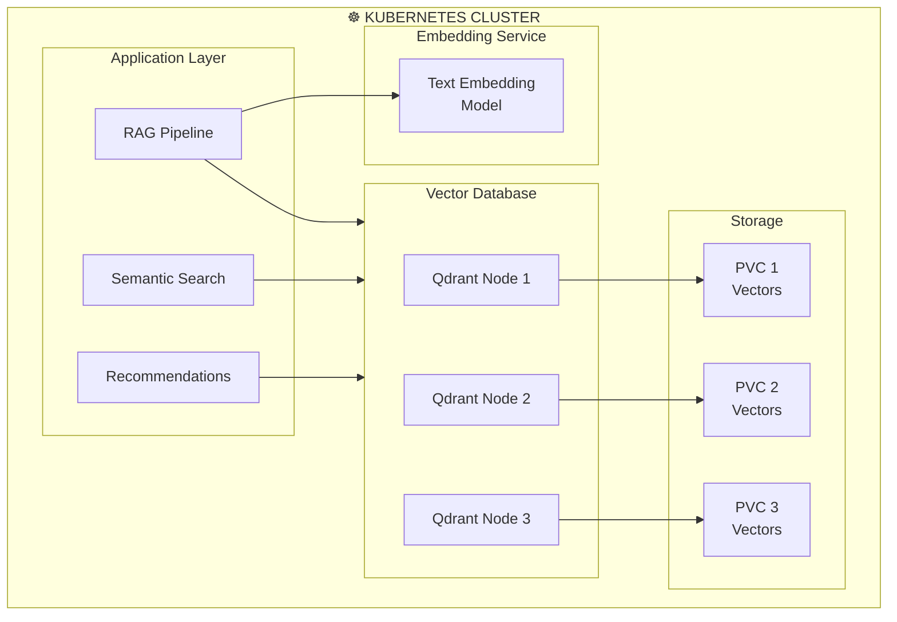

> 💡 **Quick Answer:** Deploy Qdrant (simplest): `helm install qdrant qdrant/qdrant`. Deploy Milvus (most scalable): `helm install milvus milvus/milvus --set cluster.enabled=true`. Deploy Weaviate (most features): `helm install weaviate weaviate/weaviate`. All three support persistent storage via PVCs, horizontal scaling, and provide REST/gRPC APIs for embedding storage and similarity search.
>
> **Key concept:** Vector databases store high-dimensional embeddings and perform approximate nearest neighbor (ANN) search, enabling RAG, semantic search, and recommendation systems.
>
> **Gotcha:** Vector databases are memory-intensive—each vector (1536 dims, float32) uses ~6KB. 1M vectors ≈ 6GB RAM. Plan capacity accordingly.

## The Problem

AI applications need to store and search through millions of embedding vectors:

- **RAG pipelines** require fast retrieval of relevant document chunks
- **Semantic search** needs sub-100ms similarity queries across millions of vectors
- **Traditional databases** can't efficiently perform approximate nearest neighbor search
- **Scaling** vector search while maintaining low latency is complex

## The Solution

Deploy purpose-built vector databases on Kubernetes that provide persistent storage, horizontal scaling, and high-performance ANN search.

## Architecture Overview



## Option 1: Qdrant (Simplest, Rust-based)

```bash
helm repo add qdrant https://qdrant.github.io/qdrant-helm
helm repo update

helm install qdrant qdrant/qdrant \
  -n vector-db \
  --create-namespace \
  --set replicaCount=3 \
  --set persistence.size=50Gi \
  --set persistence.storageClassName=fast-ssd \
  --set resources.requests.memory=4Gi \
  --set resources.limits.memory=8Gi
```

```yaml
# qdrant-custom-values.yaml
replicaCount: 3
persistence:
  size: 100Gi
  storageClassName: fast-ssd
resources:
  requests:
    cpu: "2"
    memory: 8Gi
  limits:
    cpu: "4"
    memory: 16Gi
config:
  cluster:
    enabled: true
    p2p:
      port: 6335
  storage:
    optimizers:
      default_segment_number: 4
      indexing_threshold: 20000
    performance:
      max_search_threads: 0  # Auto
  service:
    grpc_port: 6334
    http_port: 6333
```

## Option 2: Milvus (Most Scalable)

```bash
helm repo add milvus https://zilliztech.github.io/milvus-helm
helm repo update

helm install milvus milvus/milvus \
  -n vector-db \
  --create-namespace \
  -f milvus-values.yaml
```

```yaml
# milvus-values.yaml
cluster:
  enabled: true
etcd:
  replicaCount: 3
  persistence:
    size: 10Gi
minio:
  mode: distributed
  replicas: 4
  persistence:
    size: 100Gi
pulsar:
  enabled: true
  broker:
    replicaCount: 2
queryNode:
  replicas: 3
  resources:
    requests:
      cpu: "2"
      memory: 8Gi
    limits:
      cpu: "4"
      memory: 16Gi
indexNode:
  replicas: 2
  resources:
    requests:
      cpu: "4"
      memory: 16Gi
dataNode:
  replicas: 2
proxy:
  replicas: 2
```

## Option 3: Weaviate (Most Features)

```bash
helm repo add weaviate https://weaviate.github.io/weaviate-helm
helm repo update

helm install weaviate weaviate/weaviate \
  -n vector-db \
  --create-namespace \
  -f weaviate-values.yaml
```

```yaml
# weaviate-values.yaml
replicas: 3
storage:
  size: 100Gi
  storageClassName: fast-ssd
resources:
  requests:
    cpu: "2"
    memory: 8Gi
  limits:
    cpu: "4"
    memory: 16Gi
modules:
  text2vec-transformers:
    enabled: true
  generative-openai:
    enabled: true
env:
  QUERY_DEFAULTS_LIMIT: 25
  AUTHENTICATION_APIKEY_ENABLED: true
  AUTHENTICATION_APIKEY_ALLOWED_KEYS: "your-api-key"
```

## Testing: Insert and Query Vectors

```python
# test_qdrant.py - Example with Qdrant
from qdrant_client import QdrantClient
from qdrant_client.models import Distance, VectorParams, PointStruct

client = QdrantClient(host="qdrant.vector-db.svc.cluster.local", port=6333)

# Create collection
client.create_collection(
    collection_name="documents",
    vectors_config=VectorParams(size=1536, distance=Distance.COSINE),
)

# Insert vectors
client.upsert(
    collection_name="documents",
    points=[
        PointStruct(id=1, vector=[0.1]*1536, payload={"text": "Kubernetes networking"}),
        PointStruct(id=2, vector=[0.2]*1536, payload={"text": "Pod security"}),
    ]
)

# Search
results = client.search(
    collection_name="documents",
    query_vector=[0.15]*1536,
    limit=5,
)
```

## Comparison

| Feature | Qdrant | Milvus | Weaviate |
|---------|--------|--------|----------|
| Language | Rust | Go | Go |
| Protocol | REST/gRPC | gRPC | REST/GraphQL |
| Filtering | Rich | Rich | Rich |
| Scalability | Good | Excellent | Good |
| Complexity | Low | High | Medium |
| GPU Support | ❌ | ✅ (indexing) | ❌ |
| Built-in Embeddings | ❌ | ❌ | ✅ |

## Common Issues

### Issue 1: OOM on large collections

```bash
# Increase memory limits and enable memory-mapped storage
# Qdrant: enable mmap
config:
  storage:
    storage_type: mmap   # Keeps vectors on disk, not RAM

# Milvus: use disk index
# Set index type to DISKANN for large collections
```

### Issue 2: Slow query performance

```bash
# Ensure proper index is built
# Qdrant: indexes build automatically after threshold
# Milvus: manually create index
# pymilvus: collection.create_index(field_name="vector", index_params={"index_type": "IVF_SQ8", "nlist": 1024})

# Check if collection is loaded in memory
# Milvus: collection.load()
```

## Best Practices

1. **Size memory for your dataset** — Calculate: vectors × dimensions × 4 bytes × 1.5 (overhead)
2. **Use SSD-backed PVCs** — Vector search is I/O intensive with memory-mapped indexes
3. **Enable replication** — Run 3+ replicas for high availability
4. **Choose the right index** — HNSW for <10M vectors, IVF/DiskANN for larger datasets
5. **Batch inserts** — Insert in batches of 1000+ vectors for best throughput
6. **Monitor memory usage** — Vector DBs are memory-hungry; set alerts at 80% usage

## Key Takeaways

- **Qdrant** is the simplest to deploy and operate, ideal for small-medium scale
- **Milvus** offers the best scalability for billions of vectors with distributed architecture
- **Weaviate** provides the most features including built-in embedding modules
- **All three** support persistent storage, replication, and horizontal scaling on Kubernetes
- **Memory planning** is critical—underprovisioning leads to OOM or degraded performance
- **PVCs with SSD storage** are essential for production vector database deployments
