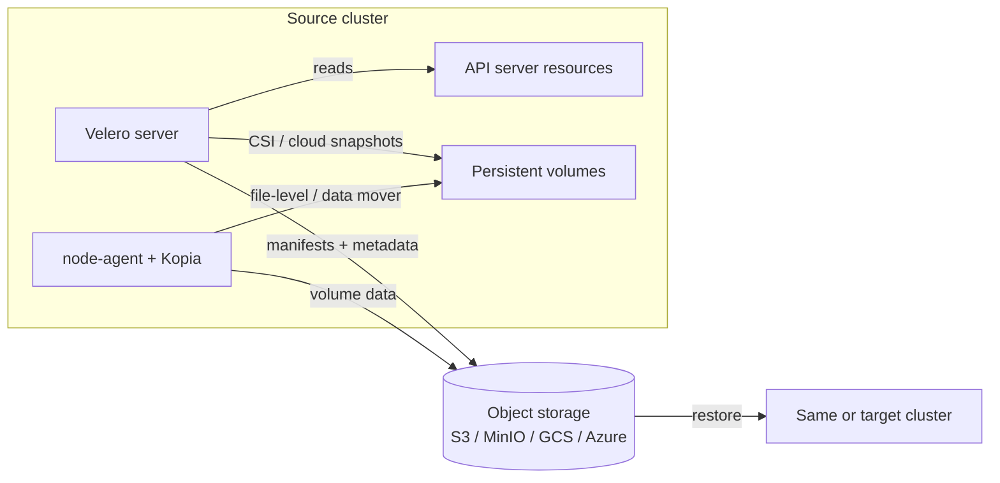

> 💡 **Quick Answer:** Velero backs up Kubernetes resources and persistent volume data to object storage (S3, GCS, Azure Blob, MinIO). Install with `velero install --provider aws --plugins velero/velero-plugin-for-aws:<ver> --bucket velero-backups --secret-file ./credentials-velero --use-node-agent`, back up with `velero backup create prod --include-namespaces production`, schedule with `velero schedule create daily --schedule="0 2 * * *" --ttl 720h`, and restore with `velero restore create --from-backup prod`.
>
> **Key commands:** `velero backup create`, `velero schedule create`, `velero restore create --namespace-mappings old:new`, `velero backup describe <name> --details`.
>
> **Gotcha:** A CSI snapshot stays in the same storage system/cloud account as the volume. For real DR, move the data off-cluster with `--snapshot-move-data` (or file-system backup via Kopia) — and test restores regularly.

## The Problem

etcd snapshots protect cluster state but not persistent volume data, can't restore a single namespace, and can't move workloads to another cluster. A single `kubectl delete namespace` — or a ransomware incident, a failed upgrade, a lost region — needs resource definitions **and** volume data restored together.



## The Solution

### Step 1: Object Storage and Credentials (AWS example)

```bash
aws s3 mb s3://velero-backups --region us-east-1

cat > velero-policy.json <<'EOF'
{
  "Version": "2012-10-17",
  "Statement": [
    { "Effect": "Allow",
      "Action": ["ec2:DescribeVolumes","ec2:DescribeSnapshots","ec2:CreateTags",
                 "ec2:CreateVolume","ec2:CreateSnapshot","ec2:DeleteSnapshot"],
      "Resource": "*" },
    { "Effect": "Allow",
      "Action": ["s3:GetObject","s3:DeleteObject","s3:PutObject",
                 "s3:AbortMultipartUpload","s3:ListMultipartUploadParts"],
      "Resource": "arn:aws:s3:::velero-backups/*" },
    { "Effect": "Allow", "Action": "s3:ListBucket",
      "Resource": "arn:aws:s3:::velero-backups" }
  ]
}
EOF
aws iam create-user --user-name velero
aws iam put-user-policy --user-name velero --policy-name velero --policy-document file://velero-policy.json
aws iam create-access-key --user-name velero

cat > credentials-velero <<'EOF'
[default]
aws_access_key_id=<ACCESS_KEY_ID>
aws_secret_access_key=<SECRET_ACCESS_KEY>
EOF
```

On EKS prefer IRSA/Pod Identity over static keys (`--no-secret` plus an annotated ServiceAccount). Use a bucket in a **separate account/region** from the cluster so a compromised or lost account doesn't take the backups with it.

### Step 2: Install Velero

```bash
VELERO_VERSION=v1.17.0       # match the AWS plugin version from the Velero compatibility matrix
brew install velero          # macOS; or:
curl -fsSL https://github.com/vmware-tanzu/velero/releases/download/${VELERO_VERSION}/velero-${VELERO_VERSION}-linux-amd64.tar.gz \
  | tar xz && sudo mv velero-${VELERO_VERSION}-linux-amd64/velero /usr/local/bin/

# AWS S3 + EBS snapshots + node-agent for file-system backup / data mover
velero install \
  --provider aws \
  --plugins velero/velero-plugin-for-aws:v1.13.0 \
  --bucket velero-backups \
  --secret-file ./credentials-velero \
  --backup-location-config region=us-east-1 \
  --snapshot-location-config region=us-east-1 \
  --use-node-agent

# MinIO / any S3-compatible store, no cloud snapshots
velero install \
  --provider aws \
  --plugins velero/velero-plugin-for-aws:v1.13.0 \
  --bucket velero \
  --secret-file ./minio-credentials \
  --backup-location-config region=minio,s3ForcePathStyle=true,s3Url=http://minio.minio.svc:9000 \
  --use-volume-snapshots=false \
  --use-node-agent \
  --default-volumes-to-fs-backup

velero version
kubectl get pods -n velero          # velero + node-agent DaemonSet
velero backup-location get          # PHASE must be Available
```

A Helm chart (`vmware-tanzu/velero`) is available for GitOps installs. On OpenShift use the **OADP** operator, which packages Velero.

### Step 3: On-Demand Backups

```bash
velero backup create full-backup                                   # whole cluster
velero backup create prod-backup --include-namespaces production,monitoring --wait
velero backup create app-backup --selector app=my-app
velero backup create secrets-backup --include-resources secrets,configmaps
velero backup create clean-backup \
  --exclude-namespaces kube-system,velero \
  --exclude-resources events,events.events.k8s.io
velero backup create temp-backup --ttl 72h                         # auto-expire

velero backup get
velero backup describe prod-backup --details
velero backup logs prod-backup
```

Declarative equivalent:

```yaml
apiVersion: velero.io/v1
kind: Backup
metadata:
  name: production-backup
  namespace: velero
spec:
  includedNamespaces: [production]
  excludedResources: [events, events.events.k8s.io]
  includeClusterResources: false
  snapshotVolumes: true
  storageLocation: default
  volumeSnapshotLocations: [default]
  ttl: 720h0m0s
```

Namespace-scoped backups include the PVs bound to their PVCs automatically; other cluster-scoped resources (CRDs, ClusterRoles) need `--include-cluster-resources=true`.

### Step 4: Scheduled Backups

```bash
velero schedule create hourly-critical \
  --schedule="0 * * * *" --include-namespaces production --ttl 168h    # 7 days

velero schedule create daily \
  --schedule="0 2 * * *" --exclude-namespaces kube-system --ttl 720h   # 30 days

velero schedule create weekly-full \
  --schedule="0 3 * * 0" --include-cluster-resources=true --ttl 2160h  # 90 days

velero schedule get
velero schedule pause daily
velero schedule unpause daily
velero backup create --from-schedule daily     # run a schedule now
```

```yaml
apiVersion: velero.io/v1
kind: Schedule
metadata:
  name: daily-production
  namespace: velero
spec:
  schedule: "0 2 * * *"          # cron, UTC; "@every 1h" also works
  useOwnerReferencesInBackup: false
  template:
    includedNamespaces: [production, staging]
    ttl: 720h0m0s
    storageLocation: default
    snapshotVolumes: true
```

### Step 5: Persistent Volume Data

| Method | How | Use when |
|---|---|---|
| Cloud/CSI snapshots | `VolumeSnapshotLocation` (EBS, PD, Azure Disk) or a CSI `VolumeSnapshotClass` labelled for Velero | Fast, crash-consistent; data stays in the same storage/account |
| CSI snapshot data movement | `velero backup create ... --snapshot-move-data` | DR: snapshot, then node-agent uploads it to object storage with Kopia |
| File-system backup (Kopia) | Pod annotation or `--default-volumes-to-fs-backup` | NFS, hostPath, local, anything without snapshots |

```yaml
# CSI: mark the VolumeSnapshotClass Velero should use
apiVersion: snapshot.storage.k8s.io/v1
kind: VolumeSnapshotClass
metadata:
  name: velero-snapclass
  labels:
    velero.io/csi-volumesnapshot-class: "true"
driver: ebs.csi.aws.com
deletionPolicy: Retain
```

CSI support is built into Velero core since 1.14 (older releases need `velero-plugin-for-csi` and `--features=EnableCSI`).

```bash
# File-system backup: opt in per pod (volume names, not PVC names)...
kubectl annotate pod db-0 backup.velero.io/backup-volumes=data
# ...or opt everything in and exclude caches
kubectl annotate pod web-0 backup.velero.io/backup-volumes-excludes=cache
```

Put the annotation on the pod **template** (Deployment/StatefulSet) so it survives restarts. Kopia is the default uploader; Restic is deprecated and `--use-restic` no longer exists (use `--use-node-agent`).

### Step 6: Application-Consistent Backups with Hooks

```yaml
# Pod template annotations — freeze writes around the snapshot
metadata:
  annotations:
    pre.hook.backup.velero.io/container: postgres
    pre.hook.backup.velero.io/command: '["/bin/bash","-c","psql -U postgres -c \"CHECKPOINT;\" && pg_dump -U postgres mydb > /var/lib/postgresql/data/backup.sql"]'
    pre.hook.backup.velero.io/timeout: 5m
    post.hook.backup.velero.io/container: postgres
    post.hook.backup.velero.io/command: '["/bin/bash","-c","rm -f /var/lib/postgresql/data/backup.sql"]'
```

Write dumps to a **backed-up volume** — a dump in `/tmp` of the container filesystem is never captured. For databases with native tooling (CloudNativePG, etc.) prefer the operator's own backups.

### Step 7: Restore

```bash
velero restore create --from-backup prod-backup
velero restore create --from-backup prod-backup --include-namespaces production
velero restore create --from-backup prod-backup --namespace-mappings production:production-restored
velero restore create --from-backup prod-backup --include-resources deployments,services,configmaps
velero restore create --from-backup prod-backup --selector app=database
velero restore create --from-backup prod-backup --existing-resource-policy=update

velero restore get
velero restore describe <restore-name> --details
velero restore logs <restore-name>
```

```yaml
apiVersion: velero.io/v1
kind: Restore
metadata:
  name: production-restore
  namespace: velero
spec:
  backupName: production-backup
  includedNamespaces: [production]
  excludedResources: [nodes, events, events.events.k8s.io]
  namespaceMapping:
    production: production-dr
  restorePVs: true
  preserveNodePorts: true
```

Restores are additive: existing objects are skipped (with a warning) unless `--existing-resource-policy=update`.

### Step 8: Test Restores Routinely

```bash
velero restore create restore-test \
  --from-backup production-backup \
  --namespace-mappings production:restore-test --wait
velero restore describe restore-test
kubectl get all,pvc -n restore-test
# run app smoke tests / verify DB row counts, then
kubectl delete namespace restore-test
```

### Step 9: Cluster Migration and Multiple Locations

```bash
# Source
velero backup create migration --include-namespaces my-app --snapshot-move-data --wait

# Target: install Velero pointing at the same bucket (read-only avoids accidents)
velero backup-location create source \
  --provider aws --bucket velero-backups --config region=us-east-1 --access-mode ReadOnly
velero backup get                     # source backups appear after sync
velero restore create --from-backup migration --wait
```

```bash
# Secondary / DR location in another region
velero backup-location create secondary \
  --provider aws --bucket velero-backups-dr --config region=eu-west-1
velero backup create dr-backup --storage-location secondary --include-namespaces production
```

The target cluster needs matching StorageClass names (or a `change-storage-class` ConfigMap mapping) and, for cloud snapshots, access to the same region/account.

## Common Issues

**Backup `PartiallyFailed` / warnings about PVCs** — no snapshot location or VolumeSnapshotClass for that driver, or the pod isn't opted into file-system backup. `velero backup describe <name> --details` lists each volume.

**Backup stuck `InProgress`** — node-agent unhealthy or a large volume still uploading. `kubectl get pods -n velero -l name=node-agent`, `kubectl logs -n velero ds/node-agent`; raise `--fs-backup-timeout` (default 4h) or switch big volumes to CSI snapshots.

**Backup location `Unavailable`** — expired credentials, wrong region/`s3Url`, or bucket policy change. Fix the `cloud-credentials` Secret and `velero backup-location get`.

**Restore skips resources: `already exists`** — expected behaviour; delete first, map to a new namespace, or use `--existing-resource-policy=update`.

**Restored PVCs Pending** — target StorageClass missing or snapshot not reachable from the target region/account; use data movement for cross-cluster.

**Hook fails with `container not found`** — `pre.hook.backup.velero.io/container` must name a container in the pod.

## Best Practices

1. **Hourly/daily/weekly schedules with decreasing TTL** — bound storage cost
2. **Off-cluster copy** — `--snapshot-move-data` or Kopia to a bucket in another account/region (3-2-1 rule)
3. **Test restores on a schedule** into a scratch namespace or cluster
4. **Hooks or operator-native backups** for databases
5. **Exclude noise** — events, pods and ReplicaSets are recreated by controllers
6. **Back up before every cluster upgrade**
7. **Encrypt the bucket** (SSE-KMS) and enable object lock/versioning against ransomware
8. **Alert on failures** — Velero exposes Prometheus metrics (`velero_backup_failure_total`, `velero_backup_last_successful_timestamp`)

## Frequently Asked Questions

### How do I schedule Velero backups?

`velero schedule create <name> --schedule="0 2 * * *" --include-namespaces <ns> --ttl 720h` or a `Schedule` CR. The schedule is a cron expression in UTC (or `@every 6h`); each run creates a Backup named `<schedule>-<timestamp>` that expires after the TTL.

### Does Velero back up persistent volumes?

Yes, three ways: cloud-provider/CSI snapshots, CSI snapshot data movement (snapshot then upload to object storage), or file-system backup with Kopia via the node-agent. Without one of these, only the PVC/PV objects are saved — not the data.

### How do I restore to another namespace?

`velero restore create --from-backup <backup> --namespace-mappings source-ns:target-ns`. Great for restore tests and cloning environments.

### Velero vs etcd backup — do I need both?

etcd snapshots restore the entire control plane state to a point in time and are the right tool for control-plane disasters. Velero is selective (namespace/label), includes volume data, and can restore into a different cluster. Production clusters typically run both.

### Can Velero migrate workloads between clusters or clouds?

Yes. Back up in the source, point the target's BackupStorageLocation at the same bucket, and restore. Use data movement or file-system backup when the target can't reach the source's snapshots, and map StorageClasses if names differ.

## Key Takeaways

- Velero backs up K8s resources + PV data to object storage and restores them selectively
- Schedules with TTL give automated retention; test restores to prove they work
- Snapshots are fast but local — move data off-cluster for real disaster recovery
- Namespace mapping and shared buckets enable restore tests and cluster migration
