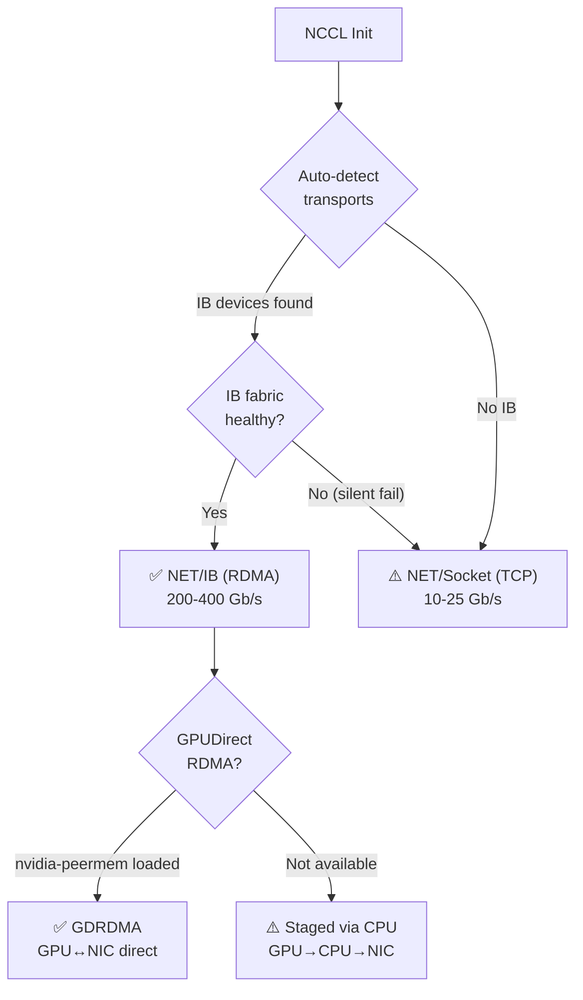

> 💡 **Quick Answer:** Set `NCCL_DEBUG=INFO` and `NCCL_DEBUG_SUBSYS=ALL` to see exactly which transport NCCL selects. If RDMA is active, logs show `NET/IB` with `mlx5_X` device names. If it falls back to TCP, you'll see `NET/Socket`. For GPUDirect RDMA proof, look for `GPU Direct RDMA Enabled` and `NET/IB/0/GDRDMA`. Combine with `perfquery`, `rdma_stats`, and `ibstat` for wire-level verification.

## The Problem

You configured InfiniBand or RoCE for your GPU cluster, but how do you **prove** that NCCL is actually using RDMA — not silently falling back to TCP sockets? Without verification, you might be running distributed training over TCP at 1/10th the bandwidth and never know it. NCCL auto-detects transports and doesn't warn loudly when it falls back.



## The Solution

### Step 1: Enable Full NCCL Debug Logging

```yaml
apiVersion: v1
kind: Pod
metadata:
  name: nccl-debug-test
spec:
  containers:
    - name: test
      image: nvcr.io/nvidia/pytorch:24.07-py3
      env:
        # Full debug output — shows every transport decision
        - name: NCCL_DEBUG
          value: "INFO"              # Options: WARN, INFO, TRACE
        - name: NCCL_DEBUG_SUBSYS
          value: "ALL"               # Log ALL subsystems
        # Other useful subsystem filters:
        # "NET"       — network transport only
        # "INIT,NET"  — initialization + network
        # "ALL"       — everything (verbose, use for debugging)
        
        # Don't force disable IB — let NCCL auto-detect
        # - name: NCCL_IB_DISABLE
        #   value: "0"
      command: ["/bin/bash", "-c"]
      args:
        - |
          # Simple all-reduce test that triggers NCCL init
          python -c "
          import torch
          import torch.distributed as dist
          import os
          os.environ['MASTER_ADDR'] = 'localhost'
          os.environ['MASTER_PORT'] = '29500'
          dist.init_process_group('nccl', rank=0, world_size=1)
          t = torch.ones(1024, device='cuda')
          dist.all_reduce(t)
          print(f'SUCCESS: all-reduce result = {t[0].item()}')
          dist.destroy_process_group()
          " 2>&1 | tee /tmp/nccl-debug.log
      resources:
        limits:
          nvidia.com/gpu: 1
```

### Step 2: Read the NCCL Logs — What to Look For

**✅ RDMA is active (InfiniBand):**
```
NCCL INFO NET/IB : Using [0]mlx5_0:1/IB [1]mlx5_1:1/IB
NCCL INFO NET/IB : GPU Direct RDMA Enabled for HCA 0 : mlx5_0
NCCL INFO NET/IB : GPU Direct RDMA Enabled for HCA 1 : mlx5_1
NCCL INFO Channel 00 : 0[0] -> 1[1] via NET/IB/0/GDRDMA
NCCL INFO Channel 01 : 0[0] -> 1[1] via NET/IB/1/GDRDMA
```

**✅ RDMA is active (RoCE):**
```
NCCL INFO NET/IB : Using [0]mlx5_0:1/RoCE [1]mlx5_1:1/RoCE
NCCL INFO NET/IB : GPU Direct RDMA Enabled for HCA 0 : mlx5_0
NCCL INFO Channel 00 : 0[0] -> 1[1] via NET/IB/0/GDRDMA
```

**⚠️ RDMA without GPUDirect (staged through CPU):**
```
NCCL INFO NET/IB : Using [0]mlx5_0:1/IB
NCCL INFO NET/IB : GPU Direct RDMA Disabled for HCA 0 : mlx5_0
NCCL INFO Channel 00 : 0[0] -> 1[1] via NET/IB/0
```
*(Still RDMA, but data goes GPU → CPU → NIC instead of GPU → NIC directly)*

**❌ Fell back to TCP sockets:**
```
NCCL INFO NET/Socket : Using [0]eth0:10.0.0.5<0>
NCCL INFO Channel 00 : 0[0] -> 1[1] via NET/Socket/0
```

**❌ No network at all (single node NVLink/PCIe only):**
```
NCCL INFO Channel 00 : 0[0] -> 1[1] via P2P/IPC/read
NCCL INFO Channel 01 : 0[0] -> 1[1] via SHM
```

### Step 3: Decode the Log Lines

```bash
# Key lines to grep from NCCL logs:

# 1. Which transport was selected?
grep "NET/" nccl-debug.log
# NET/IB   = InfiniBand/RoCE RDMA ✅
# NET/Socket = TCP fallback ❌

# 2. Is GPUDirect RDMA active?
grep "GPU Direct RDMA" nccl-debug.log
# "Enabled"  = GPU↔NIC direct transfer ✅
# "Disabled" = Staged through CPU memory ⚠️

# 3. Which HCA (network device) is used?
grep "Using \[" nccl-debug.log
# Shows mlx5_X devices and port type (IB vs RoCE)

# 4. Channel routing
grep "via NET" nccl-debug.log
# NET/IB/0/GDRDMA = RDMA with GPUDirect ✅✅
# NET/IB/0         = RDMA without GPUDirect ✅
# NET/Socket/0     = TCP ❌

# 5. Bandwidth achieved
grep "Bandwidth" nccl-debug.log
# Or run nccl-tests for measured bandwidth
```

### NCCL_DEBUG_SUBSYS Options

| Subsystem | Shows | When to Use |
|-----------|-------|-------------|
| `INIT` | Initialization, topology detection | Verify GPU/NIC discovery |
| `NET` | Network transport selection, connections | **Prove RDMA vs TCP** |
| `COLL` | Collective operations (all-reduce, etc.) | Debug hangs during training |
| `P2P` | Peer-to-peer GPU transfers (NVLink/PCIe) | Verify intra-node P2P |
| `SHM` | Shared memory transport | Debug single-node issues |
| `GRAPH` | Channel/ring topology | Optimize multi-rail configs |
| `TUNING` | Algorithm selection (ring, tree, etc.) | Performance tuning |
| `ALL` | Everything | **Full debugging** (verbose!) |

```bash
# Targeted debugging examples:

# Just network transport (most useful for RDMA verification)
NCCL_DEBUG=INFO NCCL_DEBUG_SUBSYS=NET

# Network + initialization
NCCL_DEBUG=INFO NCCL_DEBUG_SUBSYS=INIT,NET

# Maximum verbosity (generates lots of output)
NCCL_DEBUG=TRACE NCCL_DEBUG_SUBSYS=ALL

# Save to file (TRACE is extremely verbose)
NCCL_DEBUG=TRACE NCCL_DEBUG_SUBSYS=ALL NCCL_DEBUG_FILE=/tmp/nccl-trace-%h-%p.log
```

### Step 4: Wire-Level RDMA Verification

NCCL logs prove the **software** chose RDMA. These tools prove **packets actually flow over RDMA on the wire**:

```bash
# 1. Check IB port counters BEFORE and AFTER a training step
# Run on worker node:
perfquery -x  # Extended counters

# Key counters:
# PortXmitData / PortRcvData — bytes sent/received
# PortXmitPkts / PortRcvPkts — packets sent/received
# If these increase during training → RDMA traffic confirmed

# 2. Snapshot counters before training
ibstat mlx5_0 | grep -E "Rate|State"
# Rate: 200 (HDR)
# State: Active

perfquery -x mlx5_0 1 | grep -E "XmitData|RcvData" > /tmp/before.txt

# ... run training step ...

perfquery -x mlx5_0 1 | grep -E "XmitData|RcvData" > /tmp/after.txt
diff /tmp/before.txt /tmp/after.txt
# If counters increased → RDMA traffic on the wire ✅

# 3. Real-time RDMA traffic monitoring
watch -n 1 'perfquery -x mlx5_0 1 | grep -E "XmitData|RcvData"'

# 4. Check RDMA device statistics
rdma statistic show link mlx5_0/1

# 5. Verify no TCP traffic on the Ethernet interface (if using IB)
# During NCCL all-reduce, Ethernet counters should NOT increase
watch -n 1 'cat /sys/class/net/eth0/statistics/tx_bytes'
# Stable = traffic is going over IB, not Ethernet ✅
# Increasing = something is using TCP ❌
```

### Step 5: NCCL-Tests with Full Debug

```yaml
# Run nccl-tests with RDMA debug — the definitive proof
apiVersion: kubeflow.org/v2beta1
kind: MPIJob
metadata:
  name: nccl-rdma-verify
spec:
  slotsPerWorker: 8
  runPolicy:
    cleanPodPolicy: Running
  mpiReplicaSpecs:
    Launcher:
      replicas: 1
      template:
        spec:
          containers:
            - name: launcher
              image: nvcr.io/nvidia/pytorch:24.07-py3
              command: ["/bin/bash", "-c"]
              args:
                - |
                  mpirun \
                    -np 16 --npernode 8 \
                    -x NCCL_DEBUG=INFO \
                    -x NCCL_DEBUG_SUBSYS=ALL \
                    -x NCCL_IB_DISABLE=0 \
                    -x NCCL_NET_GDR_LEVEL=5 \
                    /opt/nccl-tests/build/all_reduce_perf \
                    -b 1M -e 1G -f 2 -g 1 2>&1 | tee /results/nccl-rdma-test.log
                  
                  echo "=== TRANSPORT SUMMARY ==="
                  grep "NET/" /results/nccl-rdma-test.log | sort -u
                  echo "=== GPUDirect RDMA ==="
                  grep "GPU Direct" /results/nccl-rdma-test.log | sort -u
                  echo "=== BANDWIDTH ==="
                  grep -E "^\s+[0-9]" /results/nccl-rdma-test.log | tail -5
    Worker:
      replicas: 2
      template:
        spec:
          containers:
            - name: worker
              image: nvcr.io/nvidia/pytorch:24.07-py3
              resources:
                limits:
                  nvidia.com/gpu: 8
                  rdma/rdma_shared_device_a: 1
              volumeMounts:
                - name: shm
                  mountPath: /dev/shm
          volumes:
            - name: shm
              emptyDir:
                medium: Memory
                sizeLimit: 16Gi
```

**Expected output proving RDMA:**
```
=== TRANSPORT SUMMARY ===
NCCL INFO NET/IB : Using [0]mlx5_0:1/IB [1]mlx5_1:1/IB [2]mlx5_2:1/IB [3]mlx5_3:1/IB
=== GPUDirect RDMA ===
NCCL INFO NET/IB : GPU Direct RDMA Enabled for HCA 0 : mlx5_0
NCCL INFO NET/IB : GPU Direct RDMA Enabled for HCA 1 : mlx5_1
NCCL INFO NET/IB : GPU Direct RDMA Enabled for HCA 2 : mlx5_2
NCCL INFO NET/IB : GPU Direct RDMA Enabled for HCA 3 : mlx5_3
=== BANDWIDTH ===
#    size   count  type  redop  root   time  algbw   busbw
 67108864  16777216  float  sum    -1  1.23   54.56  102.30
134217728  33554432  float  sum    -1  2.41   55.69  104.42
268435456  67108864  float  sum    -1  4.78   56.16  105.30
536870912  134217728 float  sum    -1  9.52   56.39  105.73
1073741824 268435456 float  sum    -1  18.94  56.69  106.30
```

**Bus bandwidth reference:**
- **100+ GB/s** → 4× HDR IB (200Gb/s each) with RDMA ✅
- **40-80 GB/s** → 2× HDR IB or 4× 100Gb/s RoCE ✅
- **5-15 GB/s** → Fell back to TCP ❌

### Step 6: GPUDirect RDMA Verification

```bash
# Verify nvidia-peermem module is loaded (required for GPUDirect RDMA)
lsmod | grep nvidia_peermem
# nvidia_peermem   16384  0
# If empty → GPUDirect RDMA is NOT active

# Load it
sudo modprobe nvidia-peermem

# Verify GPU-NIC affinity (GPU and NIC should be on same PCIe root)
nvidia-smi topo -m
# Expected: GPU0 ↔ mlx5_0 = PIX or PHB (same PCIe switch)
# Bad:      GPU0 ↔ mlx5_0 = SYS (crosses CPU socket — slower)

# Check GDR (GPUDirect RDMA) capability
cat /sys/kernel/mm/memory_peers/nv_mem/version
# 2.0 = nvidia-peermem v2 ✅

# Verify with NCCL env
NCCL_NET_GDR_LEVEL=5 NCCL_DEBUG=INFO python -c "
import torch.distributed as dist
# ... init and run all-reduce
" 2>&1 | grep "GPU Direct RDMA"
# "Enabled" = GPUDirect active ✅
# "Disabled" = Falling back to staged (CPU bounce) ⚠️
```

### Complete Verification Checklist

```bash
#!/bin/bash
# rdma-verify.sh — Run on each GPU node

echo "=== 1. IB Hardware ==="
ibstat 2>/dev/null || echo "❌ No IB tools (install rdma-core)"

echo -e "\n=== 2. IB Device State ==="
ibstatus 2>/dev/null | grep -E "state:|rate:" || echo "❌ No active IB ports"

echo -e "\n=== 3. RDMA Devices ==="
rdma link show 2>/dev/null || echo "❌ No RDMA devices"

echo -e "\n=== 4. nvidia-peermem (GPUDirect RDMA) ==="
if lsmod | grep -q nvidia_peermem; then
  echo "✅ nvidia-peermem loaded"
else
  echo "❌ nvidia-peermem NOT loaded — no GPUDirect RDMA"
  echo "   Fix: modprobe nvidia-peermem"
fi

echo -e "\n=== 5. GPU-NIC Topology ==="
nvidia-smi topo -m 2>/dev/null | head -20 || echo "❌ nvidia-smi not available"

echo -e "\n=== 6. IB Port Counters ==="
for dev in $(ls /sys/class/infiniband/ 2>/dev/null); do
  echo "Device: $dev"
  perfquery -x $dev 1 2>/dev/null | grep -E "XmitData|RcvData|XmitPkts|RcvPkts" || echo "  (no counters)"
done

echo -e "\n=== 7. NCCL Transport Test ==="
echo "Run with: NCCL_DEBUG=INFO NCCL_DEBUG_SUBSYS=ALL <your-training-command>"
echo "Look for: NET/IB (RDMA) vs NET/Socket (TCP)"
```

## Common Issues

| Issue | Cause | Fix |
|-------|-------|-----|
| `NET/Socket` instead of `NET/IB` | IB not detected or unhealthy | Check `ibstat`, verify port is Active |
| `GPU Direct RDMA Disabled` | nvidia-peermem not loaded | `modprobe nvidia-peermem` |
| `ib_register_peer_memory_client` error | nvidia-peermem version mismatch | Reinstall GPU driver with `--peermem` |
| Low bandwidth despite RDMA | Wrong GID index for RoCE | Set `NCCL_IB_GID_INDEX=3` |
| `NCCL WARN IB : ib_cmd error` | IB port in Init state, not Active | Check subnet manager (opensm) |
| Counters not increasing on IB | Traffic using different HCA | Check `NCCL_IB_HCA` setting |
| `GDRDMA` not appearing | GPU and NIC on different NUMA nodes | Verify with `nvidia-smi topo -m` |

## Best Practices

- **Always verify after infrastructure changes** — driver update, firmware update, or node reimage can break RDMA
- **Use `NCCL_DEBUG_SUBSYS=ALL` for initial verification, then reduce to `NET` in production** — `ALL` is very verbose
- **Save debug logs to file with `NCCL_DEBUG_FILE`** — easier to analyze than mixed stdout
- **Compare IB counter deltas** — the ground truth for wire-level RDMA traffic
- **Check `nvidia-smi topo -m`** — GPUDirect RDMA works best when GPU and NIC share a PCIe root complex
- **Run rdma-verify.sh on every node** — one misconfigured node can silently degrade the entire job
- **Remove `NCCL_DEBUG=INFO` in production** — debug logging adds latency (~5% throughput hit)

## Key Takeaways

- `NCCL_DEBUG=INFO` + `NCCL_DEBUG_SUBSYS=ALL` is the definitive way to verify RDMA
- `NET/IB` = RDMA active, `NET/Socket` = TCP fallback
- `GDRDMA` = GPUDirect RDMA (GPU↔NIC direct, bypasses CPU)
- `perfquery` counters prove packets flow on the wire — not just software selection
- nvidia-peermem module is required for GPUDirect RDMA
- Always verify after cluster changes — RDMA can silently fall back to TCP
- Expected bandwidth: 100+ GB/s bus bandwidth with 4× HDR IB, vs 5-15 GB/s on TCP
