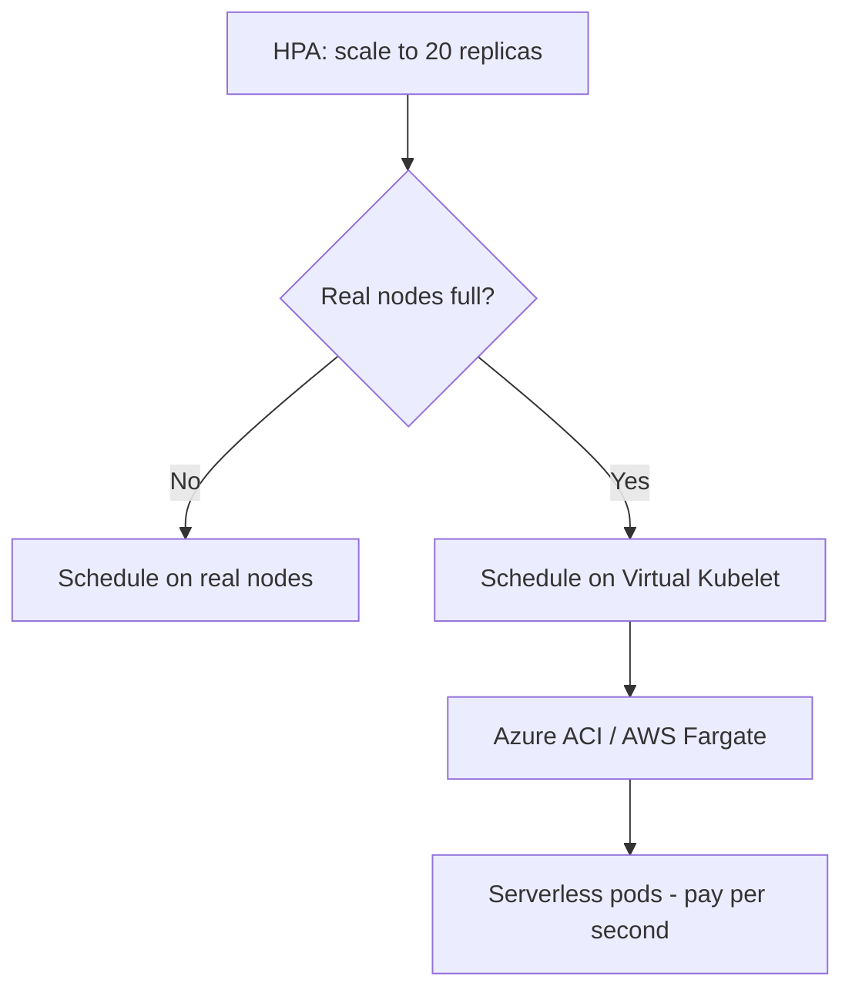

> 💡 **Quick Answer:** Deploy Virtual Kubelet to burst Kubernetes workloads to serverless backends like Azure ACI, AWS Fargate, and Hashicorp Nomad for infinite scaling.

## The Problem

Engineers frequently search for this topic but find scattered, incomplete guides. This recipe provides a comprehensive, production-ready reference.

## The Solution

### What Is Virtual Kubelet?

Virtual Kubelet masquerades as a node in your cluster but runs pods on external compute — cloud serverless, edge devices, or other orchestrators.

```bash
# Install Virtual Kubelet with ACI provider
helm repo add virtual-kubelet https://virtual-kubelet.github.io/virtual-kubelet
helm install vk virtual-kubelet/virtual-kubelet \
  --set provider=azure \
  --set providers.azure.masterUri=$(kubectl cluster-info | grep master | awk '{print $NF}')
```

```yaml
# Pod that targets Virtual Kubelet node
apiVersion: v1
kind: Pod
metadata:
  name: burst-workload
spec:
  nodeSelector:
    kubernetes.io/role: agent
    type: virtual-kubelet
  tolerations:
    - key: virtual-kubelet.io/provider
      operator: Exists
  containers:
    - name: worker
      image: my-batch-job:v1
      resources:
        requests:
          cpu: "4"
          memory: 8Gi
```

### Burst Scaling with HPA + Virtual Kubelet

```yaml
apiVersion: autoscaling/v2
kind: HorizontalPodAutoscaler
metadata:
  name: burst-hpa
spec:
  scaleTargetRef:
    apiVersion: apps/v1
    kind: Deployment
    name: web-app
  minReplicas: 3       # Run on real nodes
  maxReplicas: 100     # Burst to virtual nodes
  metrics:
    - type: Resource
      resource:
        name: cpu
        target:
          type: Utilization
          averageUtilization: 70
```

When HPA scales beyond your real node capacity, the scheduler places pods on the Virtual Kubelet node, which creates them in ACI/Fargate.



## Frequently Asked Questions

### Virtual Kubelet vs Cluster Autoscaler?

**Cluster Autoscaler** adds real VMs (minutes to provision). **Virtual Kubelet** provisions serverless containers (seconds). Use both: CA for steady load growth, VK for burst spikes.

### What are the limitations?

No DaemonSets, no hostPath volumes, no privileged containers. Network access may be limited depending on provider. Best for stateless batch/burst workloads.

## Best Practices

- Start with the simplest approach that solves your problem
- Test thoroughly in staging before production
- Monitor and iterate based on real metrics
- Document decisions for your team

## Key Takeaways

- This is essential Kubernetes operational knowledge
- Production-readiness requires proper configuration and monitoring
- Use `kubectl describe` and logs for troubleshooting
- Automate where possible to reduce human error
