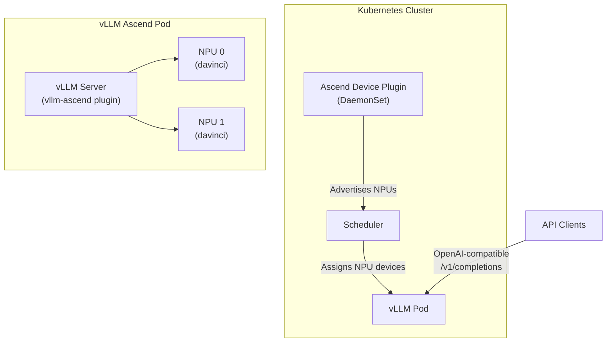

> 💡 **Quick Answer:** The `vllm-ascend` plugin enables vLLM inference on Huawei Ascend NPUs (Atlas 300I, 910B). Deploy using the `quay.io/ascend/vllm-ascend` container image with Ascend device plugin for Kubernetes. Key constraints: Atlas 300I supports only eager mode and float16. Always set `--max-model-len` explicitly on 310P to avoid OOM from the O(n²) attention mask allocation.

## The Problem

NVIDIA GPUs dominate AI inference, but Huawei Ascend NPUs offer an alternative — especially in regions with GPU supply constraints or data sovereignty requirements. The `vllm-ascend` plugin is a community-maintained extension that brings vLLM's high-performance inference engine to Ascend hardware, supporting transformer, MoE, embedding, and multi-modal models.



## The Solution

### Prerequisites: Ascend Device Plugin

```yaml
# Install Ascend device plugin (advertises NPU resources to K8s)
apiVersion: apps/v1
kind: DaemonSet
metadata:
  name: ascend-device-plugin
  namespace: kube-system
spec:
  selector:
    matchLabels:
      app: ascend-device-plugin
  template:
    metadata:
      labels:
        app: ascend-device-plugin
    spec:
      nodeSelector:
        accelerator: ascend
      containers:
        - name: device-plugin
          image: ascendhub.huawei.com/public-ascendhub/ascend-k8sdeviceplugin:v6.0.0
          securityContext:
            privileged: true
          volumeMounts:
            - name: device-plugin
              mountPath: /var/lib/kubelet/device-plugins
            - name: hiai-driver
              mountPath: /usr/local/Ascend/driver
              readOnly: true
      volumes:
        - name: device-plugin
          hostPath:
            path: /var/lib/kubelet/device-plugins
        - name: hiai-driver
          hostPath:
            path: /usr/local/Ascend/driver
```

```bash
# Verify NPUs are visible
kubectl describe node ascend-worker-1 | grep -A5 "Allocatable"
# huawei.com/Ascend310P:  8
# huawei.com/Ascend910B:  8

# Or for newer device types:
# huawei.com/npu: 8
```

### Deploy vLLM on Atlas 300I (310P)

```yaml
# Atlas 300I: eager mode only, float16 only
# CRITICAL: Always set max-model-len explicitly
apiVersion: apps/v1
kind: Deployment
metadata:
  name: vllm-qwen-7b
  labels:
    app: vllm-qwen-7b
spec:
  replicas: 1
  selector:
    matchLabels:
      app: vllm-qwen-7b
  template:
    metadata:
      labels:
        app: vllm-qwen-7b
    spec:
      nodeSelector:
        accelerator: ascend-310p
      containers:
        - name: vllm
          image: quay.io/ascend/vllm-ascend:v0.10.0rc1-310p
          command:
            - vllm
            - serve
            - Qwen/Qwen2.5-7B-Instruct
            - --tensor-parallel-size=2
            - --max-model-len=4096        # REQUIRED on 310P — prevents OOM
            - --enforce-eager             # Only eager mode supported
            - --dtype=float16             # Only float16 supported
            - --port=8000
          ports:
            - containerPort: 8000
              name: http
          env:
            - name: VLLM_USE_MODELSCOPE
              value: "True"              # Faster model download
            - name: PYTORCH_NPU_ALLOC_CONF
              value: "max_split_size_mb:256"  # Reduce fragmentation
          resources:
            limits:
              huawei.com/Ascend310P: 2   # 2 NPUs for TP=2
              memory: 32Gi
            requests:
              huawei.com/Ascend310P: 2
              memory: 16Gi
          volumeMounts:
            - name: model-cache
              mountPath: /root/.cache
            - name: shm
              mountPath: /dev/shm
      volumes:
        - name: model-cache
          persistentVolumeClaim:
            claimName: model-cache-pvc
        - name: shm
          emptyDir:
            medium: Memory
            sizeLimit: 1Gi
---
apiVersion: v1
kind: Service
metadata:
  name: vllm-qwen-7b
spec:
  selector:
    app: vllm-qwen-7b
  ports:
    - port: 8000
      targetPort: 8000
      name: http
```

### Deploy vLLM on Atlas 910B

```yaml
# Atlas 910B: supports graph mode, bf16, larger models
apiVersion: apps/v1
kind: Deployment
metadata:
  name: vllm-pangu-moe-72b
  labels:
    app: vllm-pangu-moe-72b
spec:
  replicas: 1
  selector:
    matchLabels:
      app: vllm-pangu-moe-72b
  template:
    metadata:
      labels:
        app: vllm-pangu-moe-72b
    spec:
      nodeSelector:
        accelerator: ascend-910b
      containers:
        - name: vllm
          image: quay.io/ascend/vllm-ascend:v0.10.0rc1
          command:
            - vllm
            - serve
            - Pangu-Pro-MoE-72B
            - --tensor-parallel-size=8
            - --max-model-len=8192
            - --dtype=bfloat16
            - --port=8000
          ports:
            - containerPort: 8000
          env:
            - name: VLLM_USE_MODELSCOPE
              value: "True"
          resources:
            limits:
              huawei.com/Ascend910B: 8   # Full 8-NPU node
              memory: 256Gi
            requests:
              huawei.com/Ascend910B: 8
              memory: 128Gi
          volumeMounts:
            - name: model-cache
              mountPath: /root/.cache
            - name: shm
              mountPath: /dev/shm
      volumes:
        - name: model-cache
          persistentVolumeClaim:
            claimName: model-cache-pvc
        - name: shm
          emptyDir:
            medium: Memory
            sizeLimit: 4Gi
```

### Model Sizing Guide

| Model | NPU Type | NPUs | TP Size | Max Context | Precision |
|-------|----------|------|---------|-------------|-----------|
| Qwen3-0.6B | Atlas 300I | 1 | 1 | 4096 | float16 |
| Qwen2.5-7B-Instruct | Atlas 300I | 2 | 2 | 4096 | float16 |
| Qwen2.5-VL-3B | Atlas 300I | 1 | 1 | 4096 | float16 |
| Pangu-Pro-MoE-72B | Atlas 300I | 8 | 8 | 4096 | float16 |
| Qwen2.5-72B | Atlas 910B | 8 | 8 | 8192 | bfloat16 |
| DeepSeek-V3 | Atlas 910B | 16 | 16 | 8192 | bfloat16 |

### HPA for Ascend Inference

```yaml
apiVersion: autoscaling/v2
kind: HorizontalPodAutoscaler
metadata:
  name: vllm-qwen-hpa
spec:
  scaleTargetRef:
    apiVersion: apps/v1
    kind: Deployment
    name: vllm-qwen-7b
  minReplicas: 1
  maxReplicas: 4
  metrics:
    - type: Pods
      pods:
        metric:
          name: vllm_num_requests_running
        target:
          type: AverageValue
          averageValue: "8"
  behavior:
    scaleDown:
      stabilizationWindowSeconds: 300
```

### Test the Deployment

```bash
# OpenAI-compatible API
curl http://vllm-qwen-7b:8000/v1/completions \
  -H "Content-Type: application/json" \
  -d '{
    "model": "Qwen/Qwen2.5-7B-Instruct",
    "prompt": "The future of AI is",
    "max_tokens": 64,
    "top_p": 0.95,
    "temperature": 0.6
  }'

# Chat completions
curl http://vllm-qwen-7b:8000/v1/chat/completions \
  -H "Content-Type: application/json" \
  -d '{
    "model": "Qwen/Qwen2.5-7B-Instruct",
    "messages": [{"role": "user", "content": "Explain Kubernetes in one paragraph"}],
    "max_tokens": 128
  }'

# Health check
curl http://vllm-qwen-7b:8000/health
```

## 310P OOM Deep Dive

The Atlas 300I (310P) attention implementation builds a **full causal mask** of shape `[max_model_len, max_model_len]` in float16, then converts to FRACTAL_NZ format. This is O(n²) memory:

| max_model_len | Mask Size (float16) | Risk |
|---------------|-------------------|------|
| 2048 | 8 MB | ✅ Safe |
| 4096 | 32 MB | ✅ Safe |
| 8192 | 128 MB | ⚠️ Tight |
| 16384 | 512 MB | ❌ OOM likely |
| 32768 | 2 GB | ❌ OOM certain |

**Always set `--max-model-len 4096`** (or lower) on 310P. The auto-detection reads the model config's max context (often 32K+) and allocates accordingly.

## Common Issues

| Issue | Cause | Fix |
|-------|-------|-----|
| OOM on startup (310P) | Auto-detected max_model_len too large | Set `--max-model-len 4096` explicitly |
| `bfloat16 not supported` | Atlas 300I only supports float16 | Use `--dtype float16` |
| Graph mode crash (310P) | Only eager mode supported | Add `--enforce-eager` |
| NPU not visible in pod | Device plugin not installed | Deploy ascend-device-plugin DaemonSet |
| Model download slow | Default HuggingFace mirror | Set `VLLM_USE_MODELSCOPE=True` |
| Memory fragmentation | NPU allocator defaults | Set `PYTORCH_NPU_ALLOC_CONF=max_split_size_mb:256` |

## Best Practices

- **Always set `--max-model-len` on 310P** — the #1 cause of OOM on Atlas 300I
- **Use `--enforce-eager` on 310P** — graph/compiled mode is not supported
- **Pin `--dtype float16` on 310P** — bfloat16 and some ATB ops will fail
- **Use ModelScope mirror** — significantly faster than HuggingFace in China/Asia
- **Set `PYTORCH_NPU_ALLOC_CONF`** — reduces memory fragmentation
- **Use shared model cache PVC** — avoid downloading models per pod replica
- **Monitor with vLLM Prometheus metrics** — same `/metrics` endpoint as GPU vLLM

## Key Takeaways

- `vllm-ascend` brings vLLM's OpenAI-compatible inference to Huawei Ascend NPUs
- Atlas 300I (310P): eager mode only, float16 only, explicit max-model-len required
- Atlas 910B: full feature support including bfloat16 and graph mode
- Kubernetes deployment uses Ascend device plugin for NPU scheduling
- Same OpenAI-compatible API as GPU vLLM — clients don't need changes
- Key for data sovereignty and GPU-constrained deployments
