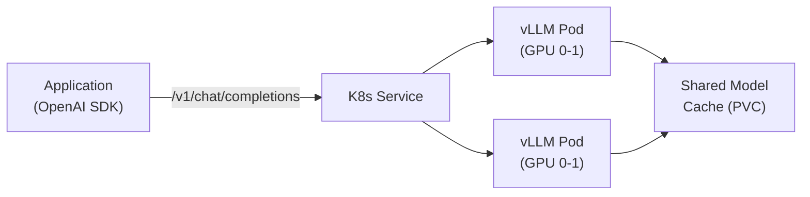

> 💡 **Quick Answer:** Deploy vLLM's OpenAI-compatible server with `ghcr.io/vllm-project/vllm-openai:latest`. Create a Deployment with GPU resources, mount a model cache PVC, and expose via Service. The container serves `/v1/completions`, `/v1/chat/completions`, and `/v1/embeddings` — drop-in replacement for the OpenAI API with any open model.

## The Problem

You want to serve open-source LLMs (Llama, Mistral, Qwen, etc.) with an OpenAI-compatible API so existing application code works without changes. The `vllm-openai` container image from `ghcr.io/vllm-project/vllm-openai` provides exactly this — a high-performance inference server with continuous batching, PagedAttention, and tensor parallelism.



## The Solution

### Basic Deployment

```yaml
apiVersion: apps/v1
kind: Deployment
metadata:
  name: vllm-server
  labels:
    app: vllm-server
spec:
  replicas: 1
  selector:
    matchLabels:
      app: vllm-server
  template:
    metadata:
      labels:
        app: vllm-server
    spec:
      containers:
        - name: vllm
          image: ghcr.io/vllm-project/vllm-openai:v0.8.0
          args:
            - --model=meta-llama/Llama-3.1-8B-Instruct
            - --tensor-parallel-size=1
            - --max-model-len=8192
            - --gpu-memory-utilization=0.90
            - --port=8000
          ports:
            - containerPort: 8000
              name: http
          env:
            - name: HUGGING_FACE_HUB_TOKEN
              valueFrom:
                secretKeyRef:
                  name: hf-token
                  key: token
          resources:
            limits:
              nvidia.com/gpu: 1
              memory: 32Gi
            requests:
              nvidia.com/gpu: 1
              memory: 16Gi
          readinessProbe:
            httpGet:
              path: /health
              port: 8000
            initialDelaySeconds: 120     # Model loading takes time
            periodSeconds: 10
          livenessProbe:
            httpGet:
              path: /health
              port: 8000
            initialDelaySeconds: 180
            periodSeconds: 30
          volumeMounts:
            - name: model-cache
              mountPath: /root/.cache/huggingface
            - name: shm
              mountPath: /dev/shm
      volumes:
        - name: model-cache
          persistentVolumeClaim:
            claimName: vllm-model-cache
        - name: shm
          emptyDir:
            medium: Memory
            sizeLimit: 2Gi
---
apiVersion: v1
kind: Service
metadata:
  name: vllm-server
spec:
  selector:
    app: vllm-server
  ports:
    - port: 8000
      targetPort: 8000
      name: http
---
apiVersion: v1
kind: Secret
metadata:
  name: hf-token
type: Opaque
stringData:
  token: "hf_xxxxxxxxxxxx"       # Your HuggingFace token
---
apiVersion: v1
kind: PersistentVolumeClaim
metadata:
  name: vllm-model-cache
spec:
  accessModes: ["ReadWriteOnce"]
  resources:
    requests:
      storage: 100Gi               # Enough for several models
```

### Multi-GPU with Tensor Parallelism

```yaml
# Llama 3.1 70B needs 4× A100 80GB (or 8× A100 40GB)
apiVersion: apps/v1
kind: Deployment
metadata:
  name: vllm-llama-70b
spec:
  replicas: 1
  selector:
    matchLabels:
      app: vllm-llama-70b
  template:
    metadata:
      labels:
        app: vllm-llama-70b
    spec:
      containers:
        - name: vllm
          image: ghcr.io/vllm-project/vllm-openai:v0.8.0
          args:
            - --model=meta-llama/Llama-3.1-70B-Instruct
            - --tensor-parallel-size=4
            - --max-model-len=8192
            - --gpu-memory-utilization=0.92
            - --enable-chunked-prefill
            - --max-num-batched-tokens=8192
            - --port=8000
          resources:
            limits:
              nvidia.com/gpu: 4
              memory: 200Gi
          readinessProbe:
            httpGet:
              path: /health
              port: 8000
            initialDelaySeconds: 300   # 70B takes longer to load
```

### Model Sizing Guide

| Model | Parameters | GPUs Needed | VRAM | TP Size |
|-------|-----------|-------------|------|---------|
| Llama 3.1 8B | 8B | 1× A100 80GB | ~16GB | 1 |
| Mistral 7B | 7B | 1× A100 80GB | ~14GB | 1 |
| Qwen2.5 14B | 14B | 1× A100 80GB | ~28GB | 1 |
| Llama 3.1 70B | 70B | 4× A100 80GB | ~140GB | 4 |
| Mixtral 8x7B | 47B (MoE) | 2× A100 80GB | ~90GB | 2 |
| Llama 3.1 405B | 405B | 8× H100 80GB | ~810GB | 8 |

### HPA Autoscaling

```yaml
apiVersion: autoscaling/v2
kind: HorizontalPodAutoscaler
metadata:
  name: vllm-hpa
spec:
  scaleTargetRef:
    apiVersion: apps/v1
    kind: Deployment
    name: vllm-server
  minReplicas: 1
  maxReplicas: 4
  metrics:
    - type: Pods
      pods:
        metric:
          name: vllm:num_requests_running
        target:
          type: AverageValue
          averageValue: "10"
  behavior:
    scaleUp:
      stabilizationWindowSeconds: 60
    scaleDown:
      stabilizationWindowSeconds: 300  # Don't scale down too fast
```

### Query the Server

```bash
# Chat completions (same as OpenAI API)
curl http://vllm-server:8000/v1/chat/completions \
  -H "Content-Type: application/json" \
  -d '{
    "model": "meta-llama/Llama-3.1-8B-Instruct",
    "messages": [
      {"role": "system", "content": "You are a helpful assistant."},
      {"role": "user", "content": "Explain Kubernetes pods in one paragraph."}
    ],
    "max_tokens": 256,
    "temperature": 0.7
  }'

# Text completions
curl http://vllm-server:8000/v1/completions \
  -H "Content-Type: application/json" \
  -d '{
    "model": "meta-llama/Llama-3.1-8B-Instruct",
    "prompt": "Kubernetes is",
    "max_tokens": 64
  }'

# List available models
curl http://vllm-server:8000/v1/models

# Prometheus metrics
curl http://vllm-server:8000/metrics
```

### Use with OpenAI Python SDK

```python
from openai import OpenAI

client = OpenAI(
    base_url="http://vllm-server:8000/v1",
    api_key="not-needed"             # vLLM doesn't require auth by default
)

response = client.chat.completions.create(
    model="meta-llama/Llama-3.1-8B-Instruct",
    messages=[
        {"role": "user", "content": "Write a haiku about Kubernetes"}
    ],
    max_tokens=64
)
print(response.choices[0].message.content)
```

## Common Issues

| Issue | Cause | Fix |
|-------|-------|-----|
| OOM on model load | Model too large for GPU VRAM | Increase `tensor-parallel-size` or use smaller model |
| Slow first response | Model loading into GPU | Set `initialDelaySeconds` high on probes |
| `CUDA out of memory` during inference | `gpu-memory-utilization` too high | Lower to 0.85-0.90 |
| Image pull slow | 10-20GB container image | Use `imagePullPolicy: IfNotPresent` + node pre-pull |
| Model download on every restart | No persistent cache | Mount PVC at `/root/.cache/huggingface` |
| 401 on model download | Gated model needs HF token | Set `HUGGING_FACE_HUB_TOKEN` secret |

## Best Practices

- **Pin image version** — use `v0.8.0` not `latest` for reproducibility
- **Use PVC for model cache** — avoids re-downloading on pod restarts
- **Set readiness probe with long delay** — model loading takes 30-300s
- **Mount `/dev/shm` as Memory** — required for multi-GPU tensor parallelism
- **Enable chunked prefill for long contexts** — `--enable-chunked-prefill`
- **Monitor with `/metrics` endpoint** — queue depth, latency, throughput
- **Use `gpu-memory-utilization=0.90`** — leaves headroom for KV cache growth

## Key Takeaways

- `ghcr.io/vllm-project/vllm-openai` provides drop-in OpenAI API compatibility
- Serves `/v1/completions`, `/v1/chat/completions`, `/v1/embeddings`
- Continuous batching + PagedAttention for high throughput
- Tensor parallelism across multiple GPUs for large models
- Existing OpenAI SDK code works with just a `base_url` change
- PVC model cache + proper probes = production-ready deployment
