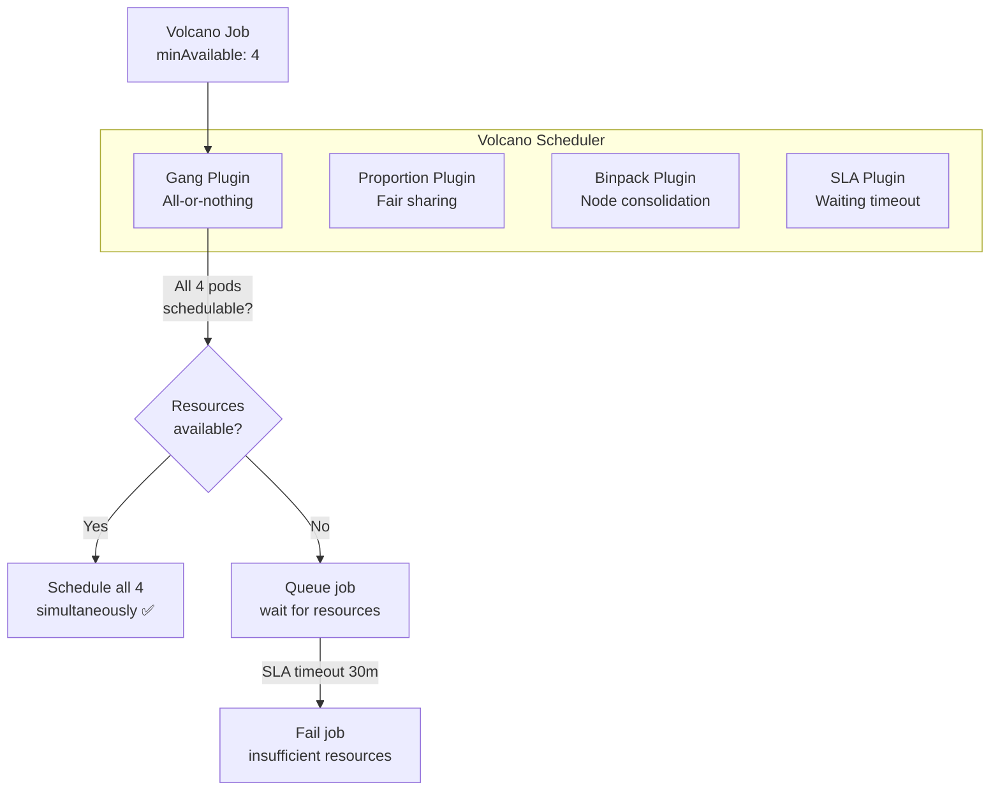

> 💡 **Quick Answer:** Install Volcano for gang scheduling (all-or-nothing pod groups), fair-share queues, and job lifecycle management. Create Volcano `Jobs` with `minAvailable` to prevent partial starts of distributed training, and `Queues` with weights for fair GPU sharing across teams.

## The Problem

Distributed training with 4 workers needs all 4 to start simultaneously — the default scheduler starts them one by one, causing worker 1-3 to idle while waiting for worker 4. Gang scheduling ensures all workers start together or none do. Volcano also provides queue-based job management for multi-tenant GPU clusters.

## The Solution

### Install Volcano

```bash
kubectl apply -f https://raw.githubusercontent.com/volcano-sh/volcano/release-1.10/installer/volcano-development.yaml
```

### Volcano Queue

```yaml
apiVersion: scheduling.volcano.sh/v1beta1
kind: Queue
metadata:
  name: training-queue
spec:
  weight: 3
  capability:
    nvidia.com/gpu: 32
    cpu: 128
    memory: 512Gi
  reclaimable: true
---
apiVersion: scheduling.volcano.sh/v1beta1
kind: Queue
metadata:
  name: inference-queue
spec:
  weight: 5
  capability:
    nvidia.com/gpu: 16
  reclaimable: false
```

### Gang-Scheduled Training Job

```yaml
apiVersion: batch.volcano.sh/v1alpha1
kind: Job
metadata:
  name: distributed-llm-train
spec:
  schedulerName: volcano
  minAvailable: 4
  queue: training-queue
  policies:
    - event: PodEvicted
      action: RestartJob
    - event: PodFailed
      action: RestartJob
    - event: TaskCompleted
      action: CompleteJob
  plugins:
    sla:
      - --waiting-time=30m
    gang:
      - --ordered-pod
  tasks:
    - replicas: 1
      name: master
      template:
        spec:
          schedulerName: volcano
          containers:
            - name: pytorch
              image: registry.example.com/training:1.0
              command: ["torchrun", "--master_addr=$(VC_MASTER_HOST)", "train.py"]
              resources:
                limits:
                  nvidia.com/gpu: 8
              env:
                - name: RANK
                  value: "0"
    - replicas: 3
      name: worker
      template:
        spec:
          schedulerName: volcano
          containers:
            - name: pytorch
              image: registry.example.com/training:1.0
              command: ["torchrun", "--master_addr=$(VC_MASTER_HOST)", "train.py"]
              resources:
                limits:
                  nvidia.com/gpu: 8
```

### Volcano Plugins

| Plugin | Purpose |
|--------|---------|
| `gang` | All-or-nothing scheduling |
| `sla` | Waiting time limits, job deadlines |
| `proportion` | Fair-share queue allocation |
| `binpack` | Pack pods onto fewer nodes |
| `nodeorder` | Custom node scoring |
| `tdm` | Time-division multiplexing |

### Monitor Queue Status

```bash
# Queue utilization
kubectl get queue -o wide

# Job status
kubectl get vcjob
kubectl describe vcjob distributed-llm-train
```



## Common Issues

**Job stuck in Pending — queue has capacity**

Volcano scheduler might not be running. Check: `kubectl get pods -n volcano-system`. Ensure `schedulerName: volcano` is set on all pod templates.

**Gang scheduling deadlock — two jobs each have partial allocation**

Volcano's gang plugin prevents this — it only admits a job when ALL pods can be scheduled. If you see partial allocation, check that `minAvailable` equals total replicas.

## Best Practices

- **`minAvailable` equals total pods** for gang scheduling — prevents partial starts
- **SLA plugin with waiting time** — fail fast if resources can't be acquired
- **Queue weights for priority** — higher weight = more resource share
- **`reclaimable: true`** for training queues — inference can reclaim GPU resources
- **`PodEvicted → RestartJob`** — automatic restart on preemption

## Key Takeaways

- Volcano provides gang scheduling — all pods start together or none do
- Prevents the #1 distributed training problem: workers idling waiting for peers
- Queue-based resource management with fair-share proportional allocation
- SLA plugin sets waiting time limits — fail fast instead of waiting indefinitely
- Integrates with PyTorch, TensorFlow, MPI, and Spark distributed workloads
