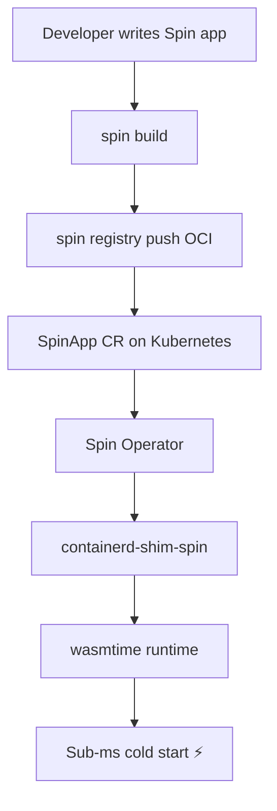

> 💡 **Quick Answer:** Deploy WebAssembly workloads on Kubernetes using SpinKube and the Spin Operator. Run Wasm components alongside containers with sub-millisecond cold starts.

## The Problem

Containers are great but have 100ms+ cold start times, large images (hundreds of MBs), and significant memory overhead. WebAssembly (Wasm) delivers near-instant startup (<1ms), tiny binaries (<1MB), and sandboxed execution — but running Wasm natively on Kubernetes requires special runtime support. SpinKube bridges this gap by adding a Wasm runtime to your cluster.

## The Solution

### Install SpinKube

```bash
# Install cert-manager (prerequisite)
kubectl apply -f https://github.com/cert-manager/cert-manager/releases/download/v1.14.0/cert-manager.yaml

# Install the Spin Operator CRDs
kubectl apply -f https://github.com/spinkube/spin-operator/releases/download/v0.4.0/spin-operator.crds.yaml

# Install the Spin Operator
kubectl apply -f https://github.com/spinkube/spin-operator/releases/download/v0.4.0/spin-operator.yaml

# Install the RuntimeClass for wasmtime
kubectl apply -f https://github.com/spinkube/spin-operator/releases/download/v0.4.0/spin-operator.runtime-class.yaml

# Install the shim executor
kubectl apply -f https://github.com/spinkube/spin-operator/releases/download/v0.4.0/spin-operator.shim-executor.yaml

# Verify
kubectl get pods -n spin-operator
```

### Deploy a Wasm Application

```yaml
apiVersion: core.spinoperator.dev/v1alpha1
kind: SpinApp
metadata:
  name: hello-wasm
spec:
  image: ghcr.io/spinkube/spin-operator/hello-world:latest
  replicas: 3
  executor: containerd-shim-spin
  resources:
    limits:
      cpu: 100m
      memory: 128Mi
```

```bash
kubectl apply -f spinapp.yaml
kubectl get spinapp

# Expose via service
kubectl expose spinapp hello-wasm --port=80 --target-port=80 --type=ClusterIP
kubectl port-forward svc/hello-wasm 8080:80
curl http://localhost:8080
```

### Build Your Own Spin App

```bash
# Install Spin CLI
curl -fsSL https://developer.fermyon.com/downloads/install.sh | bash
sudo mv spin /usr/local/bin/

# Create a new Spin app (Rust, Go, Python, JavaScript, or TypeScript)
spin new -t http-rust hello-k8s
cd hello-k8s

# Build
spin build

# Push to registry (OCI artifact)
spin registry push ghcr.io/myorg/hello-k8s:v1

# Deploy to Kubernetes
cat <<EOF | kubectl apply -f -
apiVersion: core.spinoperator.dev/v1alpha1
kind: SpinApp
metadata:
  name: hello-k8s
spec:
  image: ghcr.io/myorg/hello-k8s:v1
  replicas: 2
  executor: containerd-shim-spin
EOF
```

### Wasm vs Container Performance

| Metric | Container | Wasm (Spin) |
|--------|-----------|-------------|
| Cold start | 100-500ms | <1ms |
| Image size | 50-500MB | 1-10MB |
| Memory overhead | 30-100MB | 1-10MB |
| Sandbox isolation | Namespace/cgroup | Wasm sandbox |
| Language support | Any | Rust, Go, JS, Python, C# |

### Autoscaling Wasm Workloads

```yaml
apiVersion: core.spinoperator.dev/v1alpha1
kind: SpinApp
metadata:
  name: api-gateway
spec:
  image: ghcr.io/myorg/api-gateway:v1
  replicas: 1
  executor: containerd-shim-spin
  enableAutoscaling: true
  resources:
    limits:
      cpu: 200m
      memory: 64Mi
---
apiVersion: autoscaling/v2
kind: HorizontalPodAutoscaler
metadata:
  name: api-gateway
spec:
  scaleTargetRef:
    apiVersion: core.spinoperator.dev/v1alpha1
    kind: SpinApp
    name: api-gateway
  minReplicas: 1
  maxReplicas: 100
  metrics:
    - type: Resource
      resource:
        name: cpu
        target:
          type: Utilization
          averageUtilization: 50
```



## Common Issues

| Issue | Cause | Fix |
|-------|-------|-----|
| SpinApp stuck pending | RuntimeClass not installed | Apply runtime-class.yaml |
| OCI pull fails | Registry auth | Create imagePullSecret |
| App crashes on start | Missing Spin trigger | Check spin.toml config |
| No networking | Shim executor missing | Apply shim-executor.yaml |

## Best Practices

- Use Wasm for **latency-sensitive, lightweight** workloads (APIs, edge functions, serverless)
- Keep containers for **stateful, complex** workloads (databases, ML training)
- Pin Spin app images with digest for production
- Monitor with standard Kubernetes metrics — Wasm pods expose Prometheus metrics

## Key Takeaways

- SpinKube brings WebAssembly to Kubernetes as a first-class workload type
- Sub-millisecond cold starts make Wasm ideal for serverless and edge use cases
- OCI registry support means existing container workflows apply
- Wasm and containers coexist on the same cluster — use each where it fits best
