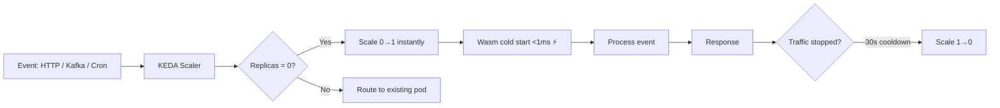

> 💡 **Quick Answer:** Build serverless functions using WebAssembly on Kubernetes with Fermyon Cloud, KEDA, and SpinKube. Achieve sub-millisecond scale-to-zero with Wasm cold starts.

## The Problem

Traditional serverless on Kubernetes (Knative, OpenFaaS) still uses containers with 100ms+ cold starts. Scale-to-zero means users wait while containers pull images and initialize. WebAssembly changes this — Wasm modules start in under 1ms, making true instant scale-to-zero a reality.

## The Solution

### SpinKube + KEDA for Event-Driven Wasm Functions

```yaml
# SpinApp with KEDA autoscaling — true scale-to-zero
apiVersion: core.spinoperator.dev/v1alpha1
kind: SpinApp
metadata:
  name: webhook-handler
spec:
  image: ghcr.io/myorg/webhook-handler:v1
  replicas: 0                    # Start at zero!
  executor: containerd-shim-spin
  resources:
    limits:
      cpu: 100m
      memory: 64Mi
---
apiVersion: keda.sh/v1alpha1
kind: ScaledObject
metadata:
  name: webhook-handler-scaler
spec:
  scaleTargetRef:
    apiVersion: core.spinoperator.dev/v1alpha1
    kind: SpinApp
    name: webhook-handler
  minReplicaCount: 0             # Scale to zero
  maxReplicaCount: 50
  cooldownPeriod: 30
  triggers:
    - type: prometheus
      metadata:
        serverAddress: http://prometheus.monitoring:9090
        metricName: http_requests_total
        query: sum(rate(http_requests_total{app="webhook-handler"}[1m]))
        threshold: "10"
    - type: kafka
      metadata:
        bootstrapServers: kafka.default:9092
        consumerGroup: webhook-handler
        topic: events
        lagThreshold: "5"
```

### Build Serverless Functions with Spin

```rust
// src/lib.rs — A Spin HTTP function in Rust
use spin_sdk::http::{IntoResponse, Request, Response};
use spin_sdk::http_component;

#[http_component]
fn handle_request(req: Request) -> anyhow::Result<impl IntoResponse> {
    let body = req.body();
    let event: serde_json::Value = serde_json::from_slice(body)?;
    
    // Process the webhook/event
    let response_body = format!(r#"{{"status":"processed","event_id":"{}"}}"#,
        event["id"].as_str().unwrap_or("unknown"));
    
    Ok(Response::builder()
        .status(200)
        .header("content-type", "application/json")
        .body(response_body)
        .build())
}
```

```toml
# spin.toml
spin_manifest_version = 2

[application]
name = "webhook-handler"
version = "1.0.0"

[[trigger.http]]
route = "/webhook"
component = "webhook-handler"

[component.webhook-handler]
source = "target/wasm32-wasi/release/webhook_handler.wasm"
allowed_outbound_hosts = ["https://api.example.com"]
key_value_stores = ["default"]
```

```bash
spin build
spin registry push ghcr.io/myorg/webhook-handler:v1
```

### Function Patterns

```yaml
# HTTP API function
apiVersion: core.spinoperator.dev/v1alpha1
kind: SpinApp
metadata:
  name: api-function
spec:
  image: ghcr.io/myorg/api-function:v1
  replicas: 1
  executor: containerd-shim-spin
---
apiVersion: v1
kind: Service
metadata:
  name: api-function
spec:
  selector:
    core.spinoperator.dev/app-name: api-function
  ports:
    - port: 80
      targetPort: 80
---
apiVersion: networking.k8s.io/v1
kind: Ingress
metadata:
  name: api-function
spec:
  rules:
    - host: api.example.com
      http:
        paths:
          - path: /
            pathType: Prefix
            backend:
              service:
                name: api-function
                port:
                  number: 80
```

### Cold Start Comparison

| Platform | Cold Start | Image Pull | Total |
|----------|-----------|------------|-------|
| AWS Lambda (container) | 200-500ms | N/A (cached) | 200-500ms |
| Knative (container) | 100-300ms | 2-10s (first) | 2-10s |
| OpenFaaS (container) | 100-200ms | 2-10s (first) | 2-10s |
| **SpinKube (Wasm)** | **<1ms** | **<100ms** | **<100ms** |
| Fermyon Cloud (Wasm) | <1ms | N/A | <1ms |



## Common Issues

| Issue | Cause | Fix |
|-------|-------|-----|
| Function can't reach external APIs | `allowed_outbound_hosts` not set | Add hosts to spin.toml |
| KEDA not scaling up | Metrics query returns 0 | Test Prometheus query manually |
| Scale-to-zero not working | `minReplicaCount` > 0 | Set to 0 in ScaledObject |
| State lost between requests | Wasm is stateless by default | Use Spin key-value store or Redis |

## Best Practices

- Use **scale-to-zero** for infrequent workloads — Wasm cold start makes it practical
- Keep functions **small and focused** — one function per trigger
- Use **Spin key-value stores** for session state, not in-memory variables
- Set **tight resource limits** — 64Mi memory is generous for most Wasm functions
- Use **KEDA** for event-driven scaling (Kafka, SQS, Prometheus metrics)

## Key Takeaways

- WebAssembly enables true instant scale-to-zero on Kubernetes
- SpinKube + KEDA provides a complete serverless platform with <1ms cold starts
- Wasm functions are 10-100x smaller and faster to start than container functions
- WASI P2 enables full HTTP, key-value, and outbound networking support
- Ideal for webhooks, API gateways, event processors, and edge functions
