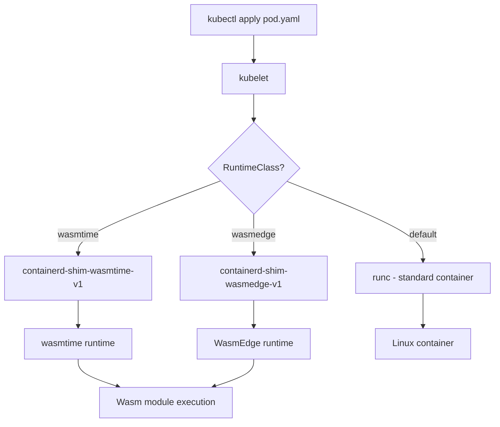

> 💡 **Quick Answer:** Run WebAssembly workloads using containerd Wasm shims with WASI support on Kubernetes. Configure runwasi, wasmtime, and WasmEdge as container runtimes.

## The Problem

You want to run WebAssembly modules on Kubernetes without a specialized operator — just using the standard containerd runtime with Wasm shims. This gives you the flexibility to mix containers and Wasm pods on the same nodes, using RuntimeClasses to select the appropriate runtime.

## The Solution

### Install containerd Wasm Shims

```bash
# On each Kubernetes node (or via DaemonSet)
# Install wasmtime shim
curl -fsSL https://github.com/containerd/runwasi/releases/download/containerd-shim-wasmtime%2Fv0.5.0/containerd-shim-wasmtime-v1-linux-amd64.tar.gz | \
  sudo tar xz -C /usr/local/bin/

# Install wasmedge shim (alternative runtime)
curl -fsSL https://github.com/containerd/runwasi/releases/download/containerd-shim-wasmedge%2Fv0.5.0/containerd-shim-wasmedge-v1-linux-amd64.tar.gz | \
  sudo tar xz -C /usr/local/bin/

# Verify shims are installed
ls -la /usr/local/bin/containerd-shim-wasmtime-v1
ls -la /usr/local/bin/containerd-shim-wasmedge-v1
```

### Configure RuntimeClasses

```yaml
# RuntimeClass for wasmtime
apiVersion: node.k8s.io/v1
kind: RuntimeClass
metadata:
  name: wasmtime
handler: wasmtime
scheduling:
  nodeSelector:
    kubernetes.io/wasm: "true"
---
# RuntimeClass for wasmedge
apiVersion: node.k8s.io/v1
kind: RuntimeClass
metadata:
  name: wasmedge
handler: wasmedge
scheduling:
  nodeSelector:
    kubernetes.io/wasm: "true"
```

```bash
# Label nodes with Wasm support
kubectl label node worker-1 kubernetes.io/wasm=true
kubectl label node worker-2 kubernetes.io/wasm=true
```

### Deploy Wasm Pods

```yaml
apiVersion: v1
kind: Pod
metadata:
  name: wasm-hello
spec:
  runtimeClassName: wasmtime
  containers:
    - name: hello
      image: ghcr.io/containerd/runwasi/wasi-demo-app:latest
      command: ["/wasi-demo-app.wasm"]
  restartPolicy: Never
---
apiVersion: apps/v1
kind: Deployment
metadata:
  name: wasm-api
spec:
  replicas: 5
  selector:
    matchLabels:
      app: wasm-api
  template:
    metadata:
      labels:
        app: wasm-api
    spec:
      runtimeClassName: wasmtime
      containers:
        - name: api
          image: ghcr.io/myorg/my-wasi-api:v1
          ports:
            - containerPort: 8080
          resources:
            requests:
              cpu: 50m
              memory: 32Mi
            limits:
              cpu: 100m
              memory: 64Mi
```

### DaemonSet to Install Shims Automatically

```yaml
apiVersion: apps/v1
kind: DaemonSet
metadata:
  name: wasm-shim-installer
  namespace: kube-system
spec:
  selector:
    matchLabels:
      app: wasm-shim-installer
  template:
    metadata:
      labels:
        app: wasm-shim-installer
    spec:
      nodeSelector:
        kubernetes.io/wasm: "true"
      initContainers:
        - name: install-shims
          image: busybox:1.36
          command: ["/bin/sh", "-c"]
          args:
            - |
              if [ ! -f /host-bin/containerd-shim-wasmtime-v1 ]; then
                wget -qO- https://github.com/containerd/runwasi/releases/download/containerd-shim-wasmtime%2Fv0.5.0/containerd-shim-wasmtime-v1-linux-amd64.tar.gz | \
                  tar xz -C /host-bin/
                echo "Installed wasmtime shim"
              fi
          volumeMounts:
            - name: host-bin
              mountPath: /host-bin
          securityContext:
            privileged: true
      containers:
        - name: pause
          image: registry.k8s.io/pause:3.9
      volumes:
        - name: host-bin
          hostPath:
            path: /usr/local/bin
            type: Directory
```

### Wasm Runtime Comparison

| Runtime | Speed | WASI Support | Networking | Best For |
|---------|-------|-------------|------------|----------|
| wasmtime | Fast | Full WASI P2 | Yes | General purpose |
| WasmEdge | Fastest | WASI + extensions | Yes + AI | Edge, AI inference |
| Wasmer | Fast | WASI P1 | Limited | Compatibility |
| wazero (Go) | Moderate | WASI P1 | Limited | Go ecosystem |



## Common Issues

| Issue | Cause | Fix |
|-------|-------|-----|
| RuntimeClass not found | Shim not installed on node | Install shim + restart containerd |
| Pod stuck ContainerCreating | Node missing wasm label | `kubectl label node <n> kubernetes.io/wasm=true` |
| Module won't start | WASI API incompatibility | Check target WASI version (P1 vs P2) |
| No network access | WASI networking not enabled | Use WASI P2 or runtime-specific extensions |

## Best Practices

- Use **RuntimeClasses** to separate Wasm and container workloads
- Label Wasm-capable nodes explicitly — not all nodes need shims
- Use **wasmtime** for production (Bytecode Alliance backed, most mature)
- Pin Wasm module versions in OCI registries like container images
- Set **tight resource limits** — Wasm modules use far less than containers

## Key Takeaways

- containerd Wasm shims let you run Wasm natively alongside containers
- RuntimeClasses provide clean separation between runc and Wasm runtimes
- No special operator needed — just shim binaries and RuntimeClass objects
- WASI P2 brings full networking and filesystem support to Wasm modules
