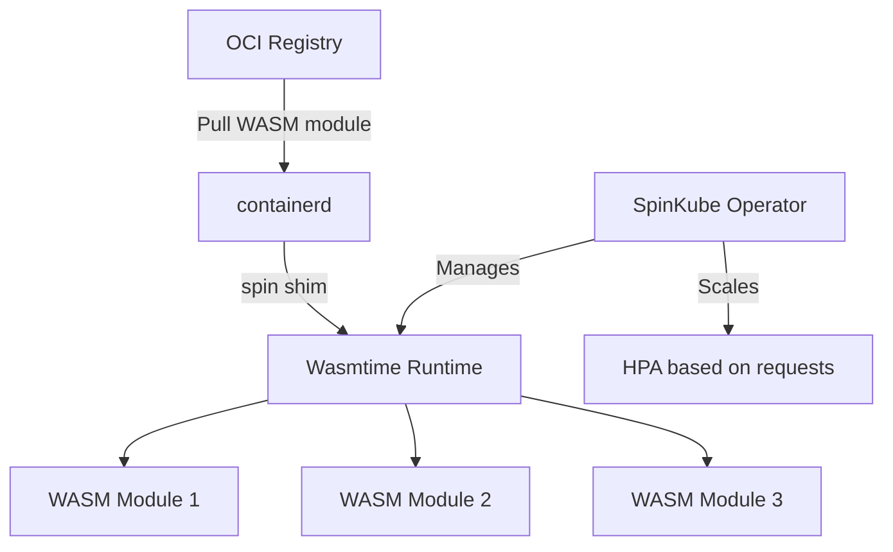

> 💡 **Quick Answer:** Deploy WASM workloads on Kubernetes using SpinKube and containerd-shim. Sub-millisecond cold starts, polyglot runtimes, and sandboxed edge computing.

## The Problem

WebAssembly (WASM) provides near-native execution speed with sub-millisecond cold starts — 100x faster than container cold starts. This makes it ideal for serverless, edge computing, and plugin architectures on Kubernetes.

## The Solution

### Step 1: Install SpinKube (Spin Operator + shim)

```bash
# Install cert-manager (prerequisite)
kubectl apply -f https://github.com/cert-manager/cert-manager/releases/latest/download/cert-manager.yaml

# Install the RuntimeClass for WASM
kubectl apply -f - << 'EOF'
apiVersion: node.k8s.io/v1
kind: RuntimeClass
metadata:
  name: wasmtime-spin
handler: spin
scheduling:
  nodeSelector:
    kubernetes.io/arch: amd64
EOF

# Install SpinKube operator
helm repo add spinkube https://spinkube.github.io/spin-operator
helm install spin-operator spinkube/spin-operator \
  --namespace spin-operator --create-namespace

# Install containerd-shim-spin on nodes (DaemonSet)
kubectl apply -f https://github.com/spinkube/spin-operator/releases/latest/download/spin-shim-installer.yaml
```

### Step 2: Deploy a WASM Application

```yaml
apiVersion: core.spinoperator.dev/v1alpha1
kind: SpinApp
metadata:
  name: hello-wasm
spec:
  image: ghcr.io/spinkube/spin-operator/hello-world:latest
  executor: containerd-shim-spin
  replicas: 3
  resources:
    limits:
      cpu: 100m
      memory: 32Mi    # WASM apps use minimal memory
---
apiVersion: v1
kind: Service
metadata:
  name: hello-wasm
spec:
  selector:
    core.spinoperator.dev/app-name: hello-wasm
  ports:
    - port: 80
      targetPort: 80
```

### Step 3: Build Your Own WASM App

```bash
# Install Spin CLI
curl -fsSL https://developer.fermyon.com/downloads/install.sh | bash
sudo mv spin /usr/local/bin/

# Create a new Spin app (Rust, Go, Python, JavaScript, C#)
spin new -t http-rust my-api
cd my-api

# Edit src/lib.rs
cat > src/lib.rs << 'RUSTEOF'
use spin_sdk::http::{IntoResponse, Request, Response};
use spin_sdk::http_component;

#[http_component]
fn handle_request(req: Request) -> anyhow::Result<impl IntoResponse> {
    Ok(Response::builder()
        .status(200)
        .header("content-type", "application/json")
        .body(r#"{"message": "Hello from WASM on K8s!"}"#)
        .build())
}
RUSTEOF

# Build and push
spin build
spin registry push my-registry.example.com/my-api:v1
```

### WASM vs Containers Performance

| Metric | Container | WASM |
|--------|-----------|------|
| Cold start | 1-30 seconds | <1 millisecond |
| Memory footprint | 50-500MB | 1-10MB |
| Image size | 50-500MB | 1-10MB |
| Startup overhead | OS + runtime + app | Runtime + app |
| Isolation | Linux namespaces | WASM sandbox |
| Language support | Any | Rust, Go, Python, JS, C# |



## Best Practices

- **Start with observation** — measure before optimizing
- **Automate** — manual processes don't scale
- **Iterate** — implement changes gradually and measure impact
- **Document** — keep runbooks for your team

## Key Takeaways

- This is a critical capability for production Kubernetes clusters
- Start with the simplest approach and evolve as needed
- Monitor and measure the impact of every change
- Share knowledge across your team with internal documentation
