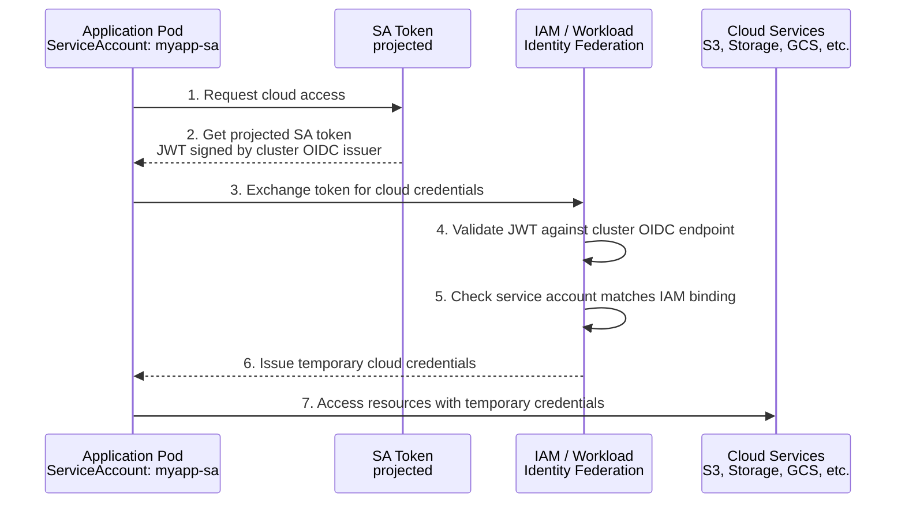

## The Problem

Pods need to access cloud services (S3, Azure Storage, GCS, databases, etc.) but storing cloud credentials as Kubernetes Secrets is insecure—secrets can leak, are hard to rotate, and provide long-lived access.

## The Solution

Use Workload Identity to allow pods to authenticate to cloud providers using their Kubernetes service account identity. The cloud provider trusts the Kubernetes OIDC issuer, eliminating the need for static credentials.

## How Workload Identity Works



## AWS: IAM Roles for Service Accounts (IRSA)

### Step 1: Enable OIDC Provider for EKS

```bash
# Get OIDC issuer URL
OIDC_URL=$(aws eks describe-cluster --name my-cluster --query "cluster.identity.oidc.issuer" --output text)
echo $OIDC_URL

# Create OIDC provider (if not exists)
eksctl utils associate-iam-oidc-provider --cluster my-cluster --approve

# Verify
aws iam list-open-id-connect-providers | grep $(echo $OIDC_URL | cut -d'/' -f5)
```

### Step 2: Create IAM Role with Trust Policy

```bash
# Get OIDC provider ARN
OIDC_PROVIDER=$(aws eks describe-cluster --name my-cluster --query "cluster.identity.oidc.issuer" --output text | sed 's|https://||')
ACCOUNT_ID=$(aws sts get-caller-identity --query Account --output text)

# Create trust policy
cat > trust-policy.json << EOF
{
  "Version": "2012-10-17",
  "Statement": [
    {
      "Effect": "Allow",
      "Principal": {
        "Federated": "arn:aws:iam::${ACCOUNT_ID}:oidc-provider/${OIDC_PROVIDER}"
      },
      "Action": "sts:AssumeRoleWithWebIdentity",
      "Condition": {
        "StringEquals": {
          "${OIDC_PROVIDER}:sub": "system:serviceaccount:production:myapp-sa",
          "${OIDC_PROVIDER}:aud": "sts.amazonaws.com"
        }
      }
    }
  ]
}
EOF

# Create IAM role
aws iam create-role \
  --role-name myapp-eks-role \
  --assume-role-policy-document file://trust-policy.json

# Attach permissions policy
aws iam attach-role-policy \
  --role-name myapp-eks-role \
  --policy-arn arn:aws:iam::aws:policy/AmazonS3ReadOnlyAccess
```

### Step 3: Create Kubernetes Service Account

```yaml
apiVersion: v1
kind: ServiceAccount
metadata:
  name: myapp-sa
  namespace: production
  annotations:
    eks.amazonaws.com/role-arn: arn:aws:iam::123456789012:role/myapp-eks-role
```

### Step 4: Deploy Application

```yaml
apiVersion: apps/v1
kind: Deployment
metadata:
  name: myapp
  namespace: production
spec:
  replicas: 2
  selector:
    matchLabels:
      app: myapp
  template:
    metadata:
      labels:
        app: myapp
    spec:
      serviceAccountName: myapp-sa
      containers:
        - name: app
          image: amazon/aws-cli:latest
          command: ["sleep", "infinity"]
          # AWS SDK automatically uses IRSA credentials
          # No AWS_ACCESS_KEY_ID or AWS_SECRET_ACCESS_KEY needed!
```

### Verify IRSA

```bash
# Check pod has correct env vars
kubectl exec -n production deploy/myapp -- env | grep AWS

# Expected output:
# AWS_ROLE_ARN=arn:aws:iam::123456789012:role/myapp-eks-role
# AWS_WEB_IDENTITY_TOKEN_FILE=/var/run/secrets/eks.amazonaws.com/serviceaccount/token

# Test S3 access
kubectl exec -n production deploy/myapp -- aws s3 ls
```

## Azure: Workload Identity

### Step 1: Enable Workload Identity on AKS

```bash
# Enable workload identity on existing cluster
az aks update \
  --resource-group myResourceGroup \
  --name myAKSCluster \
  --enable-oidc-issuer \
  --enable-workload-identity

# Get OIDC issuer URL
AKS_OIDC_ISSUER=$(az aks show \
  --resource-group myResourceGroup \
  --name myAKSCluster \
  --query "oidcIssuerProfile.issuerUrl" -o tsv)
```

### Step 2: Create Azure AD App and Federated Credential

```bash
# Create managed identity
az identity create \
  --name myapp-identity \
  --resource-group myResourceGroup \
  --location eastus

# Get identity client ID
CLIENT_ID=$(az identity show \
  --name myapp-identity \
  --resource-group myResourceGroup \
  --query clientId -o tsv)

# Create federated credential
az identity federated-credential create \
  --name myapp-federated-cred \
  --identity-name myapp-identity \
  --resource-group myResourceGroup \
  --issuer $AKS_OIDC_ISSUER \
  --subject system:serviceaccount:production:myapp-sa \
  --audience api://AzureADTokenExchange
```

### Step 3: Assign Azure RBAC Permissions

```bash
# Get identity principal ID
PRINCIPAL_ID=$(az identity show \
  --name myapp-identity \
  --resource-group myResourceGroup \
  --query principalId -o tsv)

# Assign Storage Blob Data Reader role
az role assignment create \
  --assignee $PRINCIPAL_ID \
  --role "Storage Blob Data Reader" \
  --scope /subscriptions/<subscription-id>/resourceGroups/myResourceGroup/providers/Microsoft.Storage/storageAccounts/mystorageaccount
```

### Step 4: Create Kubernetes Service Account

```yaml
apiVersion: v1
kind: ServiceAccount
metadata:
  name: myapp-sa
  namespace: production
  annotations:
    azure.workload.identity/client-id: <client-id>
  labels:
    azure.workload.identity/use: "true"
```

### Step 5: Deploy Application

```yaml
apiVersion: apps/v1
kind: Deployment
metadata:
  name: myapp
  namespace: production
spec:
  replicas: 2
  selector:
    matchLabels:
      app: myapp
  template:
    metadata:
      labels:
        app: myapp
        azure.workload.identity/use: "true"
    spec:
      serviceAccountName: myapp-sa
      containers:
        - name: app
          image: mcr.microsoft.com/azure-cli:latest
          command: ["sleep", "infinity"]
```

### Verify Azure Workload Identity

```bash
# Check pod environment
kubectl exec -n production deploy/myapp -- env | grep AZURE

# Expected:
# AZURE_CLIENT_ID=<client-id>
# AZURE_TENANT_ID=<tenant-id>
# AZURE_FEDERATED_TOKEN_FILE=/var/run/secrets/azure/tokens/azure-identity-token

# Test Azure access
kubectl exec -n production deploy/myapp -- az login --federated-token "$(cat /var/run/secrets/azure/tokens/azure-identity-token)" \
  --service-principal -u $AZURE_CLIENT_ID -t $AZURE_TENANT_ID

kubectl exec -n production deploy/myapp -- az storage blob list --account-name mystorageaccount --container-name mycontainer
```

## GCP: Workload Identity Federation

### Step 1: Enable Workload Identity on GKE

```bash
# Enable Workload Identity on cluster
gcloud container clusters update my-cluster \
  --zone us-central1-a \
  --workload-pool=my-project.svc.id.goog

# Enable on node pool
gcloud container node-pools update default-pool \
  --cluster=my-cluster \
  --zone us-central1-a \
  --workload-metadata=GKE_METADATA
```

### Step 2: Create GCP Service Account

```bash
# Create GCP service account
gcloud iam service-accounts create myapp-gcp-sa \
  --display-name="MyApp GKE Service Account"

# Grant permissions
gcloud projects add-iam-policy-binding my-project \
  --member="serviceAccount:myapp-gcp-sa@my-project.iam.gserviceaccount.com" \
  --role="roles/storage.objectViewer"
```

### Step 3: Link Kubernetes SA to GCP SA

```bash
# Allow Kubernetes SA to impersonate GCP SA
gcloud iam service-accounts add-iam-policy-binding \
  myapp-gcp-sa@my-project.iam.gserviceaccount.com \
  --role="roles/iam.workloadIdentityUser" \
  --member="serviceAccount:my-project.svc.id.goog[production/myapp-sa]"
```

### Step 4: Create Kubernetes Service Account

```yaml
apiVersion: v1
kind: ServiceAccount
metadata:
  name: myapp-sa
  namespace: production
  annotations:
    iam.gke.io/gcp-service-account: myapp-gcp-sa@my-project.iam.gserviceaccount.com
```

### Step 5: Deploy Application

```yaml
apiVersion: apps/v1
kind: Deployment
metadata:
  name: myapp
  namespace: production
spec:
  replicas: 2
  selector:
    matchLabels:
      app: myapp
  template:
    metadata:
      labels:
        app: myapp
    spec:
      serviceAccountName: myapp-sa
      nodeSelector:
        iam.gke.io/gke-metadata-server-enabled: "true"
      containers:
        - name: app
          image: google/cloud-sdk:slim
          command: ["sleep", "infinity"]
```

### Verify GCP Workload Identity

```bash
# Check which identity the pod is using
kubectl exec -n production deploy/myapp -- gcloud auth list

# Expected:
# myapp-gcp-sa@my-project.iam.gserviceaccount.com (active)

# Test GCS access
kubectl exec -n production deploy/myapp -- gsutil ls gs://my-bucket/
```

## Multi-Cloud: External Secrets Operator

### Install External Secrets Operator

```bash
helm repo add external-secrets https://charts.external-secrets.io
helm install external-secrets external-secrets/external-secrets \
  --namespace external-secrets \
  --create-namespace
```

### AWS Secrets Manager with IRSA

```yaml
apiVersion: external-secrets.io/v1beta1
kind: SecretStore
metadata:
  name: aws-secrets
  namespace: production
spec:
  provider:
    aws:
      service: SecretsManager
      region: us-east-1
      auth:
        jwt:
          serviceAccountRef:
            name: myapp-sa  # Uses IRSA
---
apiVersion: external-secrets.io/v1beta1
kind: ExternalSecret
metadata:
  name: myapp-secrets
  namespace: production
spec:
  refreshInterval: 1h
  secretStoreRef:
    name: aws-secrets
    kind: SecretStore
  target:
    name: myapp-secrets
  data:
    - secretKey: database-password
      remoteRef:
        key: myapp/database
        property: password
```

## Troubleshooting

### AWS IRSA Issues

```bash
# Check token is mounted
kubectl exec -n production deploy/myapp -- ls -la /var/run/secrets/eks.amazonaws.com/serviceaccount/

# Check token content
kubectl exec -n production deploy/myapp -- cat /var/run/secrets/eks.amazonaws.com/serviceaccount/token | cut -d'.' -f2 | base64 -d | jq .

# Verify IAM role assumption
kubectl exec -n production deploy/myapp -- aws sts get-caller-identity
```

### Azure Workload Identity Issues

```bash
# Check Azure identity webhook is running
kubectl get pods -n kube-system | grep azure-wi

# Verify federated token file
kubectl exec -n production deploy/myapp -- cat /var/run/secrets/azure/tokens/azure-identity-token

# Check pod has required labels
kubectl get pod -n production -l app=myapp -o jsonpath='{.items[0].metadata.labels}'
```

### GCP Workload Identity Issues

```bash
# Check GKE metadata server
kubectl exec -n production deploy/myapp -- curl -H "Metadata-Flavor: Google" http://169.254.169.254/computeMetadata/v1/instance/service-accounts/

# Verify IAM binding
gcloud iam service-accounts get-iam-policy myapp-gcp-sa@my-project.iam.gserviceaccount.com
```

## Best Practices

### 1. Principle of Least Privilege

```bash
# Create narrow IAM policies
# AWS: Use resource-level permissions
# Azure: Use specific resource scopes
# GCP: Use predefined roles over primitive roles
```

### 2. Namespace Isolation

```yaml
# Bind service accounts to specific namespaces in trust policy
"system:serviceaccount:production:myapp-sa"  # Good - specific
"system:serviceaccount:*:*"                   # Bad - too broad
```

### 3. Audit Cloud Access

```bash
# AWS CloudTrail
aws cloudtrail lookup-events --lookup-attributes AttributeKey=Username,AttributeValue=myapp-eks-role

# Azure Activity Log
az monitor activity-log list --resource-group myResourceGroup

# GCP Cloud Audit Logs
gcloud logging read 'protoPayload.authenticationInfo.principalEmail="myapp-gcp-sa@my-project.iam.gserviceaccount.com"'
```

## Summary

Workload Identity eliminates static cloud credentials from Kubernetes by leveraging OIDC federation. AWS uses IRSA, Azure uses Workload Identity with federated credentials, and GCP uses Workload Identity Federation. All methods provide short-lived, automatically rotated credentials with fine-grained IAM controls.

---

## 📘 Go Further with Kubernetes Recipes

**Love this recipe? There's so much more!** This is just one of **100+ hands-on recipes** in our comprehensive **[Kubernetes Recipes book](https://amzn.to/3DzC8QA)**.

Inside the book, you'll master:
- ✅ Production-ready deployment strategies
- ✅ Advanced networking and security patterns  
- ✅ Observability, monitoring, and troubleshooting
- ✅ Real-world best practices from industry experts

> *"The practical, recipe-based approach made complex Kubernetes concepts finally click for me."*

**👉 [Get Your Copy Now](https://amzn.to/3DzC8QA)** — Start building production-grade Kubernetes skills today!
